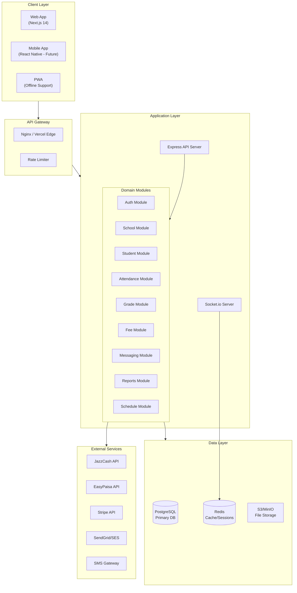
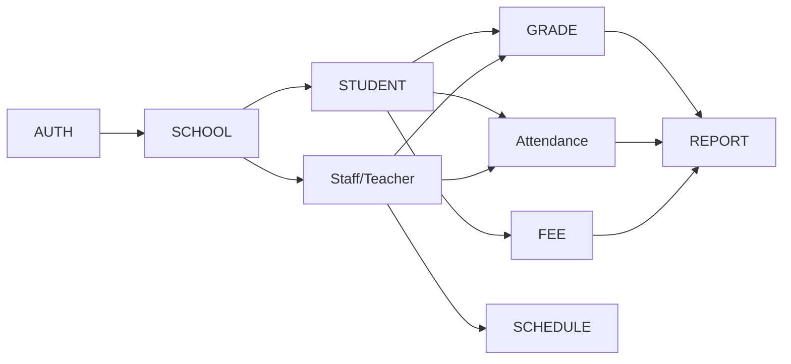
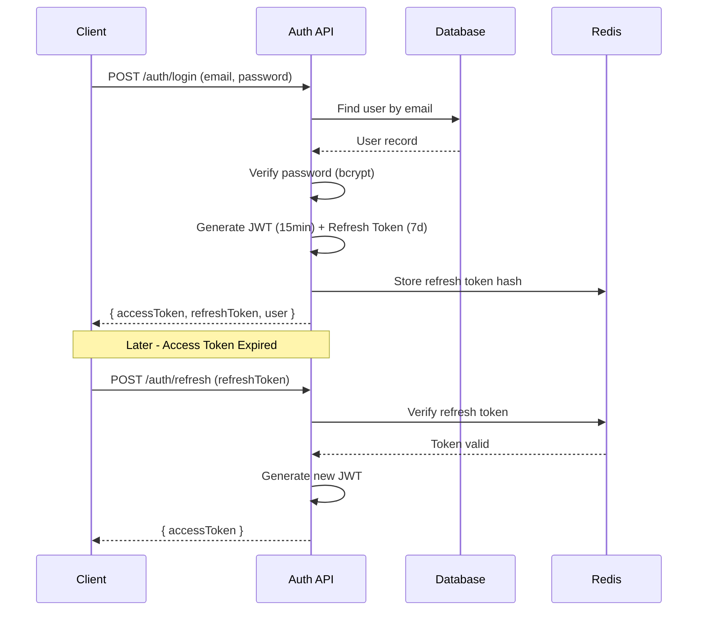
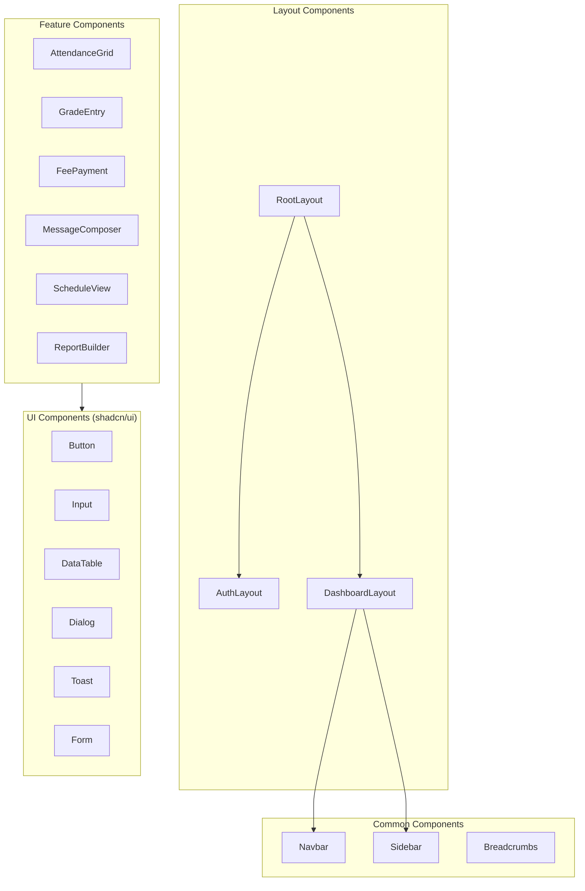
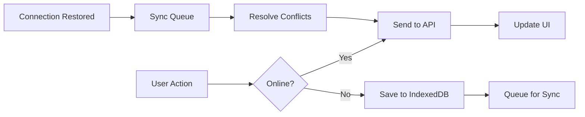
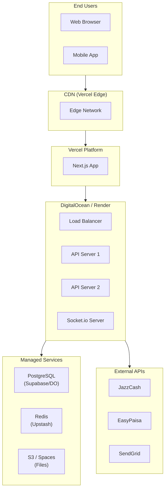
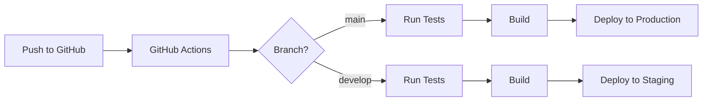

# Technical Design Document (TDD)
# EduFlow - School Management System

---

## Document Control

| Field | Details |
|-------|---------|
| **Version** | 1.0 |
| **Status** | Draft - Pending Review |
| **Created** | December 9, 2024 |
| **Based On** | [PRD v1.0](file:///c:/Users/Tayyab%20Ali/Desktop/Work/Antrigravity/SMS/EduFlow/docs/PRD/School_Management_System_PRD.md) |

---

## 1. Executive Summary

This Technical Design Document outlines the architecture, database design, API specifications, and implementation details for EduFlow - a modern School Management System targeting Pakistani educational institutions.

### Key Technical Decisions

| Area | Decision | Rationale |
|------|----------|-----------|
| **Architecture** | Modular Monolith | Easier initial development, microservices-ready |
| **Frontend** | Next.js 14 + Tailwind + shadcn/ui | SSR, performance, modern DX |
| **Backend** | Node.js + Express + TypeScript | Lightweight, familiar, scalable |
| **Database** | PostgreSQL 15+ | Relational data, robust, free tier available |
| **Cache** | Redis | Session management, performance |
| **Real-time** | Socket.io | Live notifications |
| **Auth** | JWT + Refresh Tokens | Stateless, scalable |

---

## 2. System Architecture

### 2.1 High-Level Architecture



### 2.2 Module Dependencies



### 2.3 Folder Structure

```
eduflow/
├── client/                          # Next.js Frontend
│   ├── app/                         # App Router
│   │   ├── (auth)/                  # Auth pages (login, register)
│   │   ├── (dashboard)/             # Protected dashboard routes
│   │   │   ├── admin/               # School admin pages
│   │   │   ├── teacher/             # Teacher pages
│   │   │   ├── parent/              # Parent pages
│   │   │   ├── student/             # Student pages
│   │   │   └── super-admin/         # Super admin pages
│   │   ├── api/                     # API routes (if needed)
│   │   ├── layout.tsx
│   │   └── page.tsx
│   ├── components/
│   │   ├── ui/                      # shadcn/ui components
│   │   ├── forms/                   # Form components
│   │   ├── tables/                  # Data tables
│   │   ├── charts/                  # Chart components
│   │   └── layouts/                 # Layout components
│   ├── hooks/                       # Custom React hooks
│   ├── lib/                         # Utilities
│   ├── services/                    # API service layer
│   ├── store/                       # Zustand stores
│   ├── types/                       # TypeScript types
│   └── styles/                      # Global styles
│
├── server/                          # Express Backend
│   ├── src/
│   │   ├── config/                  # Configuration files
│   │   ├── modules/                 # Feature modules
│   │   │   ├── auth/
│   │   │   │   ├── auth.controller.ts
│   │   │   │   ├── auth.service.ts
│   │   │   │   ├── auth.routes.ts
│   │   │   │   ├── auth.middleware.ts
│   │   │   │   └── auth.types.ts
│   │   │   ├── schools/
│   │   │   ├── students/
│   │   │   ├── attendance/
│   │   │   ├── grades/
│   │   │   ├── fees/
│   │   │   ├── messaging/
│   │   │   ├── schedules/
│   │   │   └── reports/
│   │   ├── shared/                  # Shared utilities
│   │   │   ├── middleware/
│   │   │   ├── utils/
│   │   │   ├── validators/
│   │   │   └── types/
│   │   ├── database/
│   │   │   ├── migrations/
│   │   │   ├── seeds/
│   │   │   └── index.ts
│   │   ├── socket/                  # Socket.io handlers
│   │   └── app.ts                   # Express app setup
│   ├── tests/
│   └── package.json
│
├── shared/                          # Shared types/utils
│   └── types/
│
├── docs/                            # Documentation
│   ├── PRD/
│   └── TDD/
│
├── docker-compose.yml
├── package.json                     # Monorepo root
└── README.md
```

---

## 3. Database Design

### 3.1 Entity Relationship Diagram

```mermaid
erDiagram
    SCHOOL ||--o{ USER : has
    SCHOOL ||--o{ CLASS : has
    SCHOOL ||--o{ ACADEMIC_YEAR : has
    SCHOOL ||--o{ SUBJECT : has
    SCHOOL ||--o{ FEE_STRUCTURE : has
    
    CLASS ||--o{ SECTION : has
    CLASS ||--|{ SUBJECT : teaches
    
    SECTION ||--o{ STUDENT : contains
    SECTION ||--o{ TIMETABLE : has
    
    USER ||--o{ STUDENT : "is parent of"
    USER ||--o{ ATTENDANCE : marks
    USER ||--o{ GRADE : enters
    USER ||--o{ MESSAGE : sends
    
    STUDENT ||--o{ ATTENDANCE : has
    STUDENT ||--o{ GRADE : receives
    STUDENT ||--o{ FEE : owes
    STUDENT ||--o{ DOCUMENT : has
    
    SUBJECT ||--o{ GRADE : "assessed in"
    SUBJECT ||--o{ TIMETABLE : "scheduled in"
    
    ASSESSMENT_TYPE ||--o{ GRADE : categorizes
    
    NOTIFICATION ||--o{ USER : "sent to"
    
    MESSAGE }o--o{ USER : "between"
```

### 3.2 Database Schema (PostgreSQL)

#### Core Tables

```sql
-- =====================================================
-- SCHOOLS & ORGANIZATION
-- =====================================================

CREATE TABLE schools (
    id UUID PRIMARY KEY DEFAULT gen_random_uuid(),
    name VARCHAR(255) NOT NULL,
    name_urdu VARCHAR(255),
    code VARCHAR(50) UNIQUE NOT NULL,           -- School code (e.g., LHR-001)
    logo_url VARCHAR(500),
    address TEXT,
    city VARCHAR(100),
    phone VARCHAR(20),
    email VARCHAR(255),
    website VARCHAR(255),
    
    -- Branding
    primary_color VARCHAR(7) DEFAULT '#4F46E5',
    secondary_color VARCHAR(7) DEFAULT '#10B981',
    
    -- Subscription
    subscription_tier VARCHAR(20) DEFAULT 'free', -- free, basic, professional, enterprise
    subscription_start DATE,
    subscription_end DATE,
    max_students INTEGER DEFAULT 100,
    
    -- Settings (JSON for flexibility)
    settings JSONB DEFAULT '{}',
    
    is_active BOOLEAN DEFAULT true,
    created_at TIMESTAMP WITH TIME ZONE DEFAULT NOW(),
    updated_at TIMESTAMP WITH TIME ZONE DEFAULT NOW()
);

CREATE INDEX idx_schools_code ON schools(code);
CREATE INDEX idx_schools_active ON schools(is_active);

-- =====================================================
-- USERS & AUTHENTICATION
-- =====================================================

CREATE TYPE user_role AS ENUM (
    'super_admin',
    'school_admin', 
    'principal',
    'teacher',
    'accountant',
    'hr',
    'parent',
    'student'
);

CREATE TYPE user_status AS ENUM ('active', 'inactive', 'pending', 'suspended');

CREATE TABLE users (
    id UUID PRIMARY KEY DEFAULT gen_random_uuid(),
    school_id UUID REFERENCES schools(id) ON DELETE CASCADE,
    
    -- Authentication
    email VARCHAR(255) NOT NULL,
    password_hash VARCHAR(255) NOT NULL,
    phone VARCHAR(20),
    
    -- Profile
    first_name VARCHAR(100) NOT NULL,
    last_name VARCHAR(100) NOT NULL,
    first_name_urdu VARCHAR(100),
    last_name_urdu VARCHAR(100),
    avatar_url VARCHAR(500),
    
    -- Role & Status
    role user_role NOT NULL,
    status user_status DEFAULT 'pending',
    
    -- Security
    email_verified BOOLEAN DEFAULT false,
    phone_verified BOOLEAN DEFAULT false,
    two_factor_enabled BOOLEAN DEFAULT false,
    two_factor_secret VARCHAR(255),
    
    -- Preferences (JSON)
    notification_preferences JSONB DEFAULT '{
        "attendance": true,
        "grades": true,
        "fees": true,
        "messages": true,
        "announcements": true,
        "frequency": "realtime",
        "quiet_hours_start": null,
        "quiet_hours_end": null
    }',
    
    last_login_at TIMESTAMP WITH TIME ZONE,
    password_changed_at TIMESTAMP WITH TIME ZONE,
    
    created_at TIMESTAMP WITH TIME ZONE DEFAULT NOW(),
    updated_at TIMESTAMP WITH TIME ZONE DEFAULT NOW(),
    
    CONSTRAINT unique_email_per_school UNIQUE (school_id, email)
);

CREATE INDEX idx_users_school ON users(school_id);
CREATE INDEX idx_users_email ON users(email);
CREATE INDEX idx_users_role ON users(role);
CREATE INDEX idx_users_status ON users(status);

-- Refresh tokens for JWT
CREATE TABLE refresh_tokens (
    id UUID PRIMARY KEY DEFAULT gen_random_uuid(),
    user_id UUID NOT NULL REFERENCES users(id) ON DELETE CASCADE,
    token_hash VARCHAR(255) NOT NULL,
    device_info VARCHAR(255),
    ip_address INET,
    expires_at TIMESTAMP WITH TIME ZONE NOT NULL,
    created_at TIMESTAMP WITH TIME ZONE DEFAULT NOW(),
    revoked_at TIMESTAMP WITH TIME ZONE
);

CREATE INDEX idx_refresh_tokens_user ON refresh_tokens(user_id);
CREATE INDEX idx_refresh_tokens_expires ON refresh_tokens(expires_at);

-- Password history for security
CREATE TABLE password_history (
    id UUID PRIMARY KEY DEFAULT gen_random_uuid(),
    user_id UUID NOT NULL REFERENCES users(id) ON DELETE CASCADE,
    password_hash VARCHAR(255) NOT NULL,
    created_at TIMESTAMP WITH TIME ZONE DEFAULT NOW()
);

-- =====================================================
-- ACADEMIC STRUCTURE
-- =====================================================

CREATE TABLE academic_years (
    id UUID PRIMARY KEY DEFAULT gen_random_uuid(),
    school_id UUID NOT NULL REFERENCES schools(id) ON DELETE CASCADE,
    name VARCHAR(50) NOT NULL,                  -- e.g., "2024-2025"
    start_date DATE NOT NULL,
    end_date DATE NOT NULL,
    is_active BOOLEAN DEFAULT false,
    created_at TIMESTAMP WITH TIME ZONE DEFAULT NOW(),
    
    CONSTRAINT unique_year_per_school UNIQUE (school_id, name)
);

CREATE TABLE classes (
    id UUID PRIMARY KEY DEFAULT gen_random_uuid(),
    school_id UUID NOT NULL REFERENCES schools(id) ON DELETE CASCADE,
    academic_year_id UUID NOT NULL REFERENCES academic_years(id) ON DELETE CASCADE,
    name VARCHAR(50) NOT NULL,                  -- e.g., "Class 5", "Grade 10"
    grade_level INTEGER,                        -- 1-10 for Matric
    display_order INTEGER DEFAULT 0,
    created_at TIMESTAMP WITH TIME ZONE DEFAULT NOW(),
    
    CONSTRAINT unique_class_per_year UNIQUE (school_id, academic_year_id, name)
);

CREATE INDEX idx_classes_school ON classes(school_id);

CREATE TABLE sections (
    id UUID PRIMARY KEY DEFAULT gen_random_uuid(),
    class_id UUID NOT NULL REFERENCES classes(id) ON DELETE CASCADE,
    name VARCHAR(10) NOT NULL,                  -- e.g., "A", "B", "Blue"
    room_number VARCHAR(20),
    capacity INTEGER DEFAULT 40,
    class_teacher_id UUID REFERENCES users(id) ON DELETE SET NULL,
    created_at TIMESTAMP WITH TIME ZONE DEFAULT NOW(),
    
    CONSTRAINT unique_section_per_class UNIQUE (class_id, name)
);

CREATE INDEX idx_sections_class ON sections(class_id);

CREATE TABLE subjects (
    id UUID PRIMARY KEY DEFAULT gen_random_uuid(),
    school_id UUID NOT NULL REFERENCES schools(id) ON DELETE CASCADE,
    name VARCHAR(100) NOT NULL,
    name_urdu VARCHAR(100),
    code VARCHAR(20),                           -- e.g., "MATH", "ENG"
    description TEXT,
    is_mandatory BOOLEAN DEFAULT true,
    created_at TIMESTAMP WITH TIME ZONE DEFAULT NOW()
);

CREATE INDEX idx_subjects_school ON subjects(school_id);

-- Which subjects are taught in which classes
CREATE TABLE class_subjects (
    id UUID PRIMARY KEY DEFAULT gen_random_uuid(),
    class_id UUID NOT NULL REFERENCES classes(id) ON DELETE CASCADE,
    subject_id UUID NOT NULL REFERENCES subjects(id) ON DELETE CASCADE,
    teacher_id UUID REFERENCES users(id) ON DELETE SET NULL,
    periods_per_week INTEGER DEFAULT 4,
    
    CONSTRAINT unique_class_subject UNIQUE (class_id, subject_id)
);

-- =====================================================
-- STUDENTS
-- =====================================================

CREATE TYPE student_status AS ENUM ('active', 'graduated', 'transferred', 'withdrawn', 'suspended');

CREATE TABLE students (
    id UUID PRIMARY KEY DEFAULT gen_random_uuid(),
    school_id UUID NOT NULL REFERENCES schools(id) ON DELETE CASCADE,
    section_id UUID REFERENCES sections(id) ON DELETE SET NULL,
    
    -- Registration
    registration_no VARCHAR(50),                -- School's internal registration number
    admission_date DATE NOT NULL,
    
    -- Personal Info
    first_name VARCHAR(100) NOT NULL,
    last_name VARCHAR(100) NOT NULL,
    first_name_urdu VARCHAR(100),
    last_name_urdu VARCHAR(100),
    
    -- Family Info
    father_name VARCHAR(200),
    father_name_urdu VARCHAR(200),
    mother_name VARCHAR(200),
    father_cnic VARCHAR(15),                    -- Pakistani CNIC format: XXXXX-XXXXXXX-X
    father_phone VARCHAR(20),
    father_occupation VARCHAR(100),
    mother_phone VARCHAR(20),
    
    -- Student Info
    date_of_birth DATE NOT NULL,
    gender VARCHAR(10),
    blood_group VARCHAR(5),
    cnic_bform VARCHAR(15),                     -- B-Form number for minors
    religion VARCHAR(50),
    nationality VARCHAR(50) DEFAULT 'Pakistani',
    
    -- Contact
    address TEXT,
    city VARCHAR(100),
    emergency_contact_name VARCHAR(200),
    emergency_contact_phone VARCHAR(20),
    emergency_contact_relation VARCHAR(50),
    
    -- Medical
    medical_conditions TEXT,
    allergies TEXT,
    
    -- Photo
    photo_url VARCHAR(500),
    
    -- Previous Education
    previous_school VARCHAR(255),
    previous_class VARCHAR(50),
    
    -- Transport
    uses_transport BOOLEAN DEFAULT false,
    transport_route_id UUID,
    
    -- Status
    status student_status DEFAULT 'active',
    
    created_at TIMESTAMP WITH TIME ZONE DEFAULT NOW(),
    updated_at TIMESTAMP WITH TIME ZONE DEFAULT NOW(),
    
    CONSTRAINT unique_reg_per_school UNIQUE (school_id, registration_no)
);

CREATE INDEX idx_students_school ON students(school_id);
CREATE INDEX idx_students_section ON students(section_id);
CREATE INDEX idx_students_status ON students(status);
CREATE INDEX idx_students_name ON students(first_name, last_name);

-- Link parents to students (many-to-many)
CREATE TABLE parent_students (
    id UUID PRIMARY KEY DEFAULT gen_random_uuid(),
    parent_id UUID NOT NULL REFERENCES users(id) ON DELETE CASCADE,
    student_id UUID NOT NULL REFERENCES students(id) ON DELETE CASCADE,
    relationship VARCHAR(50) DEFAULT 'parent',  -- parent, guardian, mother, father
    is_primary BOOLEAN DEFAULT false,           -- Primary contact for notifications
    can_pickup BOOLEAN DEFAULT true,
    
    CONSTRAINT unique_parent_student UNIQUE (parent_id, student_id)
);

CREATE INDEX idx_parent_students_parent ON parent_students(parent_id);
CREATE INDEX idx_parent_students_student ON parent_students(student_id);

-- Student documents
CREATE TABLE student_documents (
    id UUID PRIMARY KEY DEFAULT gen_random_uuid(),
    student_id UUID NOT NULL REFERENCES students(id) ON DELETE CASCADE,
    document_type VARCHAR(50) NOT NULL,         -- birth_certificate, bform, report_card, etc.
    document_name VARCHAR(255) NOT NULL,
    file_url VARCHAR(500) NOT NULL,
    file_size INTEGER,
    mime_type VARCHAR(100),
    uploaded_by UUID REFERENCES users(id),
    created_at TIMESTAMP WITH TIME ZONE DEFAULT NOW()
);

CREATE INDEX idx_student_docs ON student_documents(student_id);

-- =====================================================
-- ATTENDANCE
-- =====================================================

CREATE TYPE attendance_status AS ENUM (
    'present',
    'absent', 
    'late',
    'early_dismissal',
    'half_day',
    'sick_leave',
    'approved_leave'
);

CREATE TABLE attendance (
    id UUID PRIMARY KEY DEFAULT gen_random_uuid(),
    student_id UUID NOT NULL REFERENCES students(id) ON DELETE CASCADE,
    section_id UUID NOT NULL REFERENCES sections(id) ON DELETE CASCADE,
    date DATE NOT NULL,
    status attendance_status NOT NULL DEFAULT 'present',
    
    -- Additional info
    check_in_time TIME,
    check_out_time TIME,
    notes TEXT,
    
    -- Metadata
    marked_by UUID NOT NULL REFERENCES users(id),
    marked_at TIMESTAMP WITH TIME ZONE DEFAULT NOW(),
    
    -- For corrections
    is_corrected BOOLEAN DEFAULT false,
    corrected_by UUID REFERENCES users(id),
    corrected_at TIMESTAMP WITH TIME ZONE,
    correction_reason TEXT,
    
    -- Offline sync support
    client_id VARCHAR(100),                     -- For offline conflict resolution
    synced_at TIMESTAMP WITH TIME ZONE,
    
    created_at TIMESTAMP WITH TIME ZONE DEFAULT NOW(),
    updated_at TIMESTAMP WITH TIME ZONE DEFAULT NOW(),
    
    CONSTRAINT unique_attendance_per_day UNIQUE (student_id, date)
);

CREATE INDEX idx_attendance_student ON attendance(student_id);
CREATE INDEX idx_attendance_section ON attendance(section_id);
CREATE INDEX idx_attendance_date ON attendance(date);
CREATE INDEX idx_attendance_status ON attendance(status);

-- =====================================================
-- GRADES & ASSESSMENTS
-- =====================================================

CREATE TYPE assessment_category AS ENUM (
    'quiz',
    'assignment',
    'classwork',
    'homework',
    'midterm',
    'final',
    'project',
    'practical',
    'other'
);

CREATE TABLE assessments (
    id UUID PRIMARY KEY DEFAULT gen_random_uuid(),
    section_id UUID NOT NULL REFERENCES sections(id) ON DELETE CASCADE,
    subject_id UUID NOT NULL REFERENCES subjects(id) ON DELETE CASCADE,
    
    name VARCHAR(200) NOT NULL,                 -- e.g., "Quiz 1", "Midterm Exam"
    category assessment_category NOT NULL,
    total_marks DECIMAL(5,2) NOT NULL,
    weightage DECIMAL(5,2) DEFAULT 100,         -- Percentage weight in final grade
    
    assessment_date DATE NOT NULL,
    due_date DATE,                              -- For assignments
    
    description TEXT,
    instructions TEXT,
    
    created_by UUID NOT NULL REFERENCES users(id),
    created_at TIMESTAMP WITH TIME ZONE DEFAULT NOW(),
    updated_at TIMESTAMP WITH TIME ZONE DEFAULT NOW()
);

CREATE INDEX idx_assessments_section ON assessments(section_id);
CREATE INDEX idx_assessments_subject ON assessments(subject_id);
CREATE INDEX idx_assessments_date ON assessments(assessment_date);

CREATE TABLE grades (
    id UUID PRIMARY KEY DEFAULT gen_random_uuid(),
    student_id UUID NOT NULL REFERENCES students(id) ON DELETE CASCADE,
    assessment_id UUID NOT NULL REFERENCES assessments(id) ON DELETE CASCADE,
    
    marks_obtained DECIMAL(5,2),
    percentage DECIMAL(5,2),                    -- Calculated
    letter_grade VARCHAR(5),                    -- A+, A, B+, etc.
    
    remarks TEXT,
    is_absent BOOLEAN DEFAULT false,            -- If student was absent for exam
    
    entered_by UUID NOT NULL REFERENCES users(id),
    entered_at TIMESTAMP WITH TIME ZONE DEFAULT NOW(),
    
    -- Auto-save support
    is_draft BOOLEAN DEFAULT false,
    last_auto_saved TIMESTAMP WITH TIME ZONE,
    
    updated_at TIMESTAMP WITH TIME ZONE DEFAULT NOW(),
    
    CONSTRAINT unique_grade_per_assessment UNIQUE (student_id, assessment_id)
);

CREATE INDEX idx_grades_student ON grades(student_id);
CREATE INDEX idx_grades_assessment ON grades(assessment_id);

-- Grading scales per school
CREATE TABLE grading_scales (
    id UUID PRIMARY KEY DEFAULT gen_random_uuid(),
    school_id UUID NOT NULL REFERENCES schools(id) ON DELETE CASCADE,
    name VARCHAR(100) NOT NULL,
    is_default BOOLEAN DEFAULT false,
    
    -- Scale definition as JSON
    scales JSONB NOT NULL DEFAULT '[
        {"letter": "A+", "min": 90, "max": 100, "gpa": 4.0},
        {"letter": "A", "min": 80, "max": 89, "gpa": 3.7},
        {"letter": "B+", "min": 70, "max": 79, "gpa": 3.3},
        {"letter": "B", "min": 60, "max": 69, "gpa": 3.0},
        {"letter": "C+", "min": 50, "max": 59, "gpa": 2.5},
        {"letter": "C", "min": 40, "max": 49, "gpa": 2.0},
        {"letter": "D", "min": 33, "max": 39, "gpa": 1.0},
        {"letter": "F", "min": 0, "max": 32, "gpa": 0.0}
    ]',
    
    created_at TIMESTAMP WITH TIME ZONE DEFAULT NOW()
);

-- =====================================================
-- FEE MANAGEMENT
-- =====================================================

CREATE TYPE fee_type AS ENUM (
    'tuition',
    'admission',
    'registration',
    'examination',
    'transport',
    'books',
    'uniform',
    'activities',
    'sports',
    'lab',
    'computer',
    'library',
    'other'
);

CREATE TYPE fee_frequency AS ENUM ('one_time', 'monthly', 'quarterly', 'biannual', 'annual');
CREATE TYPE payment_status AS ENUM ('pending', 'partial', 'paid', 'overdue', 'waived', 'refunded');
CREATE TYPE payment_method AS ENUM ('cash', 'bank_transfer', 'jazzcash', 'easypaisa', 'stripe', 'cheque', 'other');

-- Fee structure templates
CREATE TABLE fee_structures (
    id UUID PRIMARY KEY DEFAULT gen_random_uuid(),
    school_id UUID NOT NULL REFERENCES schools(id) ON DELETE CASCADE,
    academic_year_id UUID NOT NULL REFERENCES academic_years(id),
    
    name VARCHAR(200) NOT NULL,
    fee_type fee_type NOT NULL,
    frequency fee_frequency NOT NULL,
    amount DECIMAL(10,2) NOT NULL,
    
    -- Apply to specific classes (null = all classes)
    applicable_classes UUID[],
    
    -- Late fee configuration
    late_fee_amount DECIMAL(10,2) DEFAULT 0,
    late_fee_percentage DECIMAL(5,2) DEFAULT 0,
    grace_period_days INTEGER DEFAULT 10,
    
    due_day_of_month INTEGER DEFAULT 10,        -- For monthly fees
    
    is_active BOOLEAN DEFAULT true,
    created_at TIMESTAMP WITH TIME ZONE DEFAULT NOW()
);

-- Actual fees assigned to students
CREATE TABLE fees (
    id UUID PRIMARY KEY DEFAULT gen_random_uuid(),
    student_id UUID NOT NULL REFERENCES students(id) ON DELETE CASCADE,
    fee_structure_id UUID REFERENCES fee_structures(id),
    
    fee_type fee_type NOT NULL,
    description VARCHAR(255),
    amount DECIMAL(10,2) NOT NULL,
    
    due_date DATE NOT NULL,
    
    -- Discounts
    discount_amount DECIMAL(10,2) DEFAULT 0,
    discount_reason VARCHAR(255),               -- sibling, merit, staff_child, etc.
    
    -- Late fee
    late_fee DECIMAL(10,2) DEFAULT 0,
    late_fee_applied_at TIMESTAMP WITH TIME ZONE,
    
    -- Final amount
    total_amount DECIMAL(10,2) NOT NULL,        -- amount - discount + late_fee
    paid_amount DECIMAL(10,2) DEFAULT 0,
    balance DECIMAL(10,2) NOT NULL,
    
    status payment_status DEFAULT 'pending',
    
    created_at TIMESTAMP WITH TIME ZONE DEFAULT NOW(),
    updated_at TIMESTAMP WITH TIME ZONE DEFAULT NOW()
);

CREATE INDEX idx_fees_student ON fees(student_id);
CREATE INDEX idx_fees_status ON fees(status);
CREATE INDEX idx_fees_due_date ON fees(due_date);

-- Payment transactions
CREATE TABLE payments (
    id UUID PRIMARY KEY DEFAULT gen_random_uuid(),
    fee_id UUID NOT NULL REFERENCES fees(id) ON DELETE CASCADE,
    student_id UUID NOT NULL REFERENCES students(id),
    
    amount DECIMAL(10,2) NOT NULL,
    payment_method payment_method NOT NULL,
    
    -- Transaction details
    transaction_id VARCHAR(100),                -- External gateway transaction ID
    gateway_response JSONB,
    
    -- Receipt
    receipt_number VARCHAR(50),
    receipt_url VARCHAR(500),
    
    -- For cash/cheque payments
    received_by UUID REFERENCES users(id),
    
    payment_date DATE NOT NULL DEFAULT CURRENT_DATE,
    notes TEXT,
    
    created_at TIMESTAMP WITH TIME ZONE DEFAULT NOW()
);

CREATE INDEX idx_payments_fee ON payments(fee_id);
CREATE INDEX idx_payments_student ON payments(student_id);
CREATE INDEX idx_payments_date ON payments(payment_date);

-- =====================================================
-- TIMETABLE & SCHEDULING
-- =====================================================

CREATE TABLE timetable_slots (
    id UUID PRIMARY KEY DEFAULT gen_random_uuid(),
    school_id UUID NOT NULL REFERENCES schools(id) ON DELETE CASCADE,
    name VARCHAR(50) NOT NULL,                  -- "Period 1", "Lunch", etc.
    start_time TIME NOT NULL,
    end_time TIME NOT NULL,
    slot_order INTEGER NOT NULL,
    is_break BOOLEAN DEFAULT false,
    
    CONSTRAINT unique_slot_per_school UNIQUE (school_id, slot_order)
);

CREATE TABLE timetables (
    id UUID PRIMARY KEY DEFAULT gen_random_uuid(),
    section_id UUID NOT NULL REFERENCES sections(id) ON DELETE CASCADE,
    slot_id UUID NOT NULL REFERENCES timetable_slots(id) ON DELETE CASCADE,
    day_of_week INTEGER NOT NULL CHECK (day_of_week BETWEEN 1 AND 7), -- 1=Monday
    
    subject_id UUID REFERENCES subjects(id) ON DELETE SET NULL,
    teacher_id UUID REFERENCES users(id) ON DELETE SET NULL,
    room_number VARCHAR(20),
    
    created_at TIMESTAMP WITH TIME ZONE DEFAULT NOW(),
    updated_at TIMESTAMP WITH TIME ZONE DEFAULT NOW(),
    
    CONSTRAINT unique_timetable_slot UNIQUE (section_id, slot_id, day_of_week)
);

CREATE INDEX idx_timetable_section ON timetables(section_id);
CREATE INDEX idx_timetable_teacher ON timetables(teacher_id);
CREATE INDEX idx_timetable_day ON timetables(day_of_week);

-- =====================================================
-- MESSAGING & NOTIFICATIONS
-- =====================================================

CREATE TYPE message_type AS ENUM ('direct', 'broadcast', 'announcement');
CREATE TYPE notification_type AS ENUM (
    'attendance_absent',
    'attendance_late',
    'grade_posted',
    'fee_due',
    'fee_overdue',
    'fee_received',
    'message_received',
    'announcement',
    'assignment_due',
    'general'
);

CREATE TABLE messages (
    id UUID PRIMARY KEY DEFAULT gen_random_uuid(),
    school_id UUID NOT NULL REFERENCES schools(id) ON DELETE CASCADE,
    
    sender_id UUID NOT NULL REFERENCES users(id),
    message_type message_type NOT NULL,
    
    subject VARCHAR(255),
    body TEXT NOT NULL,
    
    -- For announcements: target audience
    target_roles user_role[],
    target_classes UUID[],
    target_sections UUID[],
    
    is_urgent BOOLEAN DEFAULT false,
    is_pinned BOOLEAN DEFAULT false,
    
    -- Attachments as JSON array
    attachments JSONB DEFAULT '[]',
    
    scheduled_at TIMESTAMP WITH TIME ZONE,
    sent_at TIMESTAMP WITH TIME ZONE,
    
    created_at TIMESTAMP WITH TIME ZONE DEFAULT NOW()
);

CREATE INDEX idx_messages_school ON messages(school_id);
CREATE INDEX idx_messages_sender ON messages(sender_id);
CREATE INDEX idx_messages_type ON messages(message_type);

-- Message recipients and read status
CREATE TABLE message_recipients (
    id UUID PRIMARY KEY DEFAULT gen_random_uuid(),
    message_id UUID NOT NULL REFERENCES messages(id) ON DELETE CASCADE,
    recipient_id UUID NOT NULL REFERENCES users(id) ON DELETE CASCADE,
    
    read_at TIMESTAMP WITH TIME ZONE,
    archived_at TIMESTAMP WITH TIME ZONE,
    
    CONSTRAINT unique_message_recipient UNIQUE (message_id, recipient_id)
);

CREATE INDEX idx_msg_recipients_user ON message_recipients(recipient_id);

CREATE TABLE notifications (
    id UUID PRIMARY KEY DEFAULT gen_random_uuid(),
    user_id UUID NOT NULL REFERENCES users(id) ON DELETE CASCADE,
    
    type notification_type NOT NULL,
    title VARCHAR(255) NOT NULL,
    body TEXT,
    
    -- Link to related entity
    entity_type VARCHAR(50),                    -- student, attendance, grade, fee, message
    entity_id UUID,
    
    is_read BOOLEAN DEFAULT false,
    read_at TIMESTAMP WITH TIME ZONE,
    
    -- Delivery channels
    sent_via_email BOOLEAN DEFAULT false,
    sent_via_sms BOOLEAN DEFAULT false,
    sent_via_push BOOLEAN DEFAULT false,
    
    created_at TIMESTAMP WITH TIME ZONE DEFAULT NOW()
);

CREATE INDEX idx_notifications_user ON notifications(user_id);
CREATE INDEX idx_notifications_read ON notifications(is_read);
CREATE INDEX idx_notifications_created ON notifications(created_at DESC);

-- =====================================================
-- AUDIT LOG
-- =====================================================

CREATE TABLE audit_logs (
    id UUID PRIMARY KEY DEFAULT gen_random_uuid(),
    school_id UUID REFERENCES schools(id),
    user_id UUID REFERENCES users(id),
    
    action VARCHAR(50) NOT NULL,                -- create, update, delete, login, etc.
    entity_type VARCHAR(50) NOT NULL,           -- user, student, attendance, etc.
    entity_id UUID,
    
    old_values JSONB,
    new_values JSONB,
    
    ip_address INET,
    user_agent TEXT,
    
    created_at TIMESTAMP WITH TIME ZONE DEFAULT NOW()
);

CREATE INDEX idx_audit_school ON audit_logs(school_id);
CREATE INDEX idx_audit_user ON audit_logs(user_id);
CREATE INDEX idx_audit_entity ON audit_logs(entity_type, entity_id);
CREATE INDEX idx_audit_created ON audit_logs(created_at DESC);

-- Partition audit logs by month for performance
-- CREATE TABLE audit_logs_2024_12 PARTITION OF audit_logs FOR VALUES FROM ('2024-12-01') TO ('2025-01-01');
```

### 3.3 Database Indexes Strategy

| Table | Index | Purpose |
|-------|-------|---------|
| `students` | `(school_id, section_id)` | List students by class |
| `attendance` | `(student_id, date)` | Quick attendance lookup |
| `attendance` | `(section_id, date)` | Class attendance view |
| `grades` | `(student_id, assessment_id)` | Student grade lookup |
| `fees` | `(student_id, status)` | Outstanding fees |
| `notifications` | `(user_id, is_read, created_at)` | Unread notifications |

---

## 4. API Design

### 4.1 API Standards

| Standard | Implementation |
|----------|----------------|
| **Protocol** | HTTPS only (TLS 1.3) |
| **Format** | JSON |
| **Versioning** | URL path (`/api/v1/`) |
| **Auth** | Bearer JWT token |
| **Rate Limiting** | 100 req/min (general), 10 req/min (auth) |
| **Pagination** | Cursor-based for lists |
| **Errors** | Standard error envelope |

### 4.2 Response Format

**Success Response:**
```json
{
  "success": true,
  "data": { ... },
  "meta": {
    "page": 1,
    "perPage": 20,
    "total": 150,
    "nextCursor": "abc123"
  }
}
```

**Error Response:**
```json
{
  "success": false,
  "error": {
    "code": "VALIDATION_ERROR",
    "message": "Invalid input data",
    "details": [
      { "field": "email", "message": "Invalid email format" }
    ]
  }
}
```

### 4.3 API Endpoints

#### Authentication Module

| Method | Endpoint | Description | Auth |
|--------|----------|-------------|------|
| POST | `/api/v1/auth/register` | Register new user | Public |
| POST | `/api/v1/auth/login` | User login | Public |
| POST | `/api/v1/auth/logout` | Logout (revoke token) | Required |
| POST | `/api/v1/auth/refresh` | Refresh access token | Public |
| POST | `/api/v1/auth/forgot-password` | Request password reset | Public |
| POST | `/api/v1/auth/reset-password` | Reset password with token | Public |
| GET | `/api/v1/auth/me` | Get current user profile | Required |
| PUT | `/api/v1/auth/me` | Update profile | Required |
| PUT | `/api/v1/auth/change-password` | Change password | Required |
| POST | `/api/v1/auth/2fa/enable` | Enable 2FA | Required |
| POST | `/api/v1/auth/2fa/verify` | Verify 2FA code | Required |

#### Schools Module

| Method | Endpoint | Description | Auth |
|--------|----------|-------------|------|
| GET | `/api/v1/schools` | List all schools (super admin) | Super Admin |
| POST | `/api/v1/schools` | Create new school | Super Admin |
| GET | `/api/v1/schools/:id` | Get school details | School Admin+ |
| PUT | `/api/v1/schools/:id` | Update school | School Admin |
| PUT | `/api/v1/schools/:id/branding` | Update branding | School Admin |
| GET | `/api/v1/schools/:id/stats` | School dashboard stats | School Admin+ |

#### Students Module

| Method | Endpoint | Description | Auth |
|--------|----------|-------------|------|
| GET | `/api/v1/students` | List students (with filters) | Teacher+ |
| POST | `/api/v1/students` | Create student | School Admin |
| POST | `/api/v1/students/bulk-import` | Import from Excel | School Admin |
| GET | `/api/v1/students/:id` | Get student profile | Teacher+ |
| PUT | `/api/v1/students/:id` | Update student | School Admin |
| DELETE | `/api/v1/students/:id` | Delete student (soft) | School Admin |
| POST | `/api/v1/students/:id/documents` | Upload document | School Admin |
| GET | `/api/v1/students/:id/attendance` | Student attendance history | Teacher+ |
| GET | `/api/v1/students/:id/grades` | Student grades | Teacher+ |
| GET | `/api/v1/students/:id/fees` | Student fee status | Accountant+ |

#### Attendance Module

| Method | Endpoint | Description | Auth |
|--------|----------|-------------|------|
| GET | `/api/v1/attendance/section/:sectionId` | Get section attendance for date | Teacher |
| POST | `/api/v1/attendance/bulk` | Mark attendance (bulk) | Teacher |
| PUT | `/api/v1/attendance/:id` | Correct attendance | Teacher |
| GET | `/api/v1/attendance/reports` | Attendance reports | Admin+ |
| POST | `/api/v1/attendance/sync` | Sync offline attendance | Teacher |

#### Grades Module

| Method | Endpoint | Description | Auth |
|--------|----------|-------------|------|
| GET | `/api/v1/assessments` | List assessments | Teacher |
| POST | `/api/v1/assessments` | Create assessment | Teacher |
| PUT | `/api/v1/assessments/:id` | Update assessment | Teacher |
| GET | `/api/v1/assessments/:id/grades` | Get grades for assessment | Teacher |
| POST | `/api/v1/assessments/:id/grades` | Enter grades (bulk) | Teacher |
| PUT | `/api/v1/grades/:id` | Update single grade | Teacher |
| GET | `/api/v1/students/:id/report-card` | Generate report card | Admin+ |

#### Fee Module

| Method | Endpoint | Description | Auth |
|--------|----------|-------------|------|
| GET | `/api/v1/fees` | List fees (with filters) | Accountant+ |
| POST | `/api/v1/fees/generate` | Generate fees for students | Accountant |
| GET | `/api/v1/fees/:id` | Get fee details | Parent+ |
| POST | `/api/v1/fees/:id/pay` | Initiate payment | Parent |
| POST | `/api/v1/fees/:id/record-payment` | Record manual payment | Accountant |
| POST | `/api/v1/webhooks/jazzcash` | JazzCash payment webhook | Public |
| POST | `/api/v1/webhooks/easypaisa` | EasyPaisa payment webhook | Public |
| GET | `/api/v1/payments/:id/receipt` | Download receipt | Parent+ |
| GET | `/api/v1/fees/reports` | Financial reports | Accountant+ |

#### Messaging Module

| Method | Endpoint | Description | Auth |
|--------|----------|-------------|------|
| GET | `/api/v1/messages` | List messages (inbox) | Required |
| POST | `/api/v1/messages` | Send message | Required |
| GET | `/api/v1/messages/:id` | Get message | Required |
| PUT | `/api/v1/messages/:id/read` | Mark as read | Required |
| POST | `/api/v1/announcements` | Create announcement | Admin+ |
| GET | `/api/v1/notifications` | Get notifications | Required |
| PUT | `/api/v1/notifications/read-all` | Mark all read | Required |

#### Schedule Module

| Method | Endpoint | Description | Auth |
|--------|----------|-------------|------|
| GET | `/api/v1/timetable/section/:id` | Get section timetable | Teacher+ |
| GET | `/api/v1/timetable/teacher/:id` | Get teacher schedule | Teacher |
| PUT | `/api/v1/timetable/section/:id` | Update timetable | Admin |
| GET | `/api/v1/my/schedule` | Get current user's schedule | Required |

---

## 5. Authentication & Authorization

### 5.1 Authentication Flow



### 5.2 JWT Token Structure

```json
{
  "sub": "user-uuid",
  "email": "user@school.com",
  "role": "teacher",
  "schoolId": "school-uuid",
  "permissions": ["attendance:write", "grades:write"],
  "iat": 1702156800,
  "exp": 1702157700
}
```

### 5.3 Role-Based Access Control (RBAC)

| Role | Permissions |
|------|-------------|
| **Super Admin** | All permissions across all schools |
| **School Admin** | All permissions within their school |
| **Principal** | Read all, manage teachers, reports |
| **Teacher** | Attendance, grades for assigned classes |
| **Accountant** | Fee management, financial reports |
| **HR** | Staff management |
| **Parent** | Read own children's data, pay fees |
| **Student** | Read own data |

### 5.4 Permission Matrix

```typescript
const PERMISSIONS = {
  // Schools
  'schools:read': ['super_admin', 'school_admin', 'principal'],
  'schools:write': ['super_admin', 'school_admin'],
  
  // Students
  'students:read': ['school_admin', 'principal', 'teacher', 'parent'],
  'students:write': ['school_admin'],
  
  // Attendance
  'attendance:read': ['school_admin', 'principal', 'teacher', 'parent'],
  'attendance:write': ['teacher'],
  
  // Grades
  'grades:read': ['school_admin', 'principal', 'teacher', 'parent', 'student'],
  'grades:write': ['teacher'],
  
  // Fees
  'fees:read': ['school_admin', 'accountant', 'parent'],
  'fees:write': ['school_admin', 'accountant'],
  'fees:pay': ['parent'],
  
  // Messages
  'messages:read': ['*'],
  'messages:write': ['school_admin', 'principal', 'teacher'],
  'announcements:write': ['school_admin', 'principal'],
  
  // Reports
  'reports:read': ['school_admin', 'principal', 'accountant'],
  'reports:write': ['school_admin'],
};
```

---

## 6. Frontend Architecture

### 6.1 Component Hierarchy



### 6.2 State Management (Zustand)

```typescript
// stores/authStore.ts
interface AuthState {
  user: User | null;
  accessToken: string | null;
  isLoading: boolean;
  
  login: (credentials: LoginCredentials) => Promise<void>;
  logout: () => void;
  refreshToken: () => Promise<void>;
}

// stores/attendanceStore.ts
interface AttendanceState {
  students: StudentAttendance[];
  isSaving: boolean;
  lastSaved: Date | null;
  pendingSync: AttendanceRecord[];
  
  markAllPresent: () => void;
  toggleStatus: (studentId: string, status: AttendanceStatus) => void;
  saveAttendance: () => Promise<void>;
  syncOffline: () => Promise<void>;
}

// stores/notificationStore.ts
interface NotificationState {
  notifications: Notification[];
  unreadCount: number;
  
  fetchNotifications: () => Promise<void>;
  markAsRead: (id: string) => void;
  markAllAsRead: () => void;
}
```

### 6.3 Key UI Patterns

#### Attendance Grid (30-Second Mark)

```
┌─────────────────────────────────────────────────────────┐
│  Class 5-A Attendance - Dec 9, 2024     [Mark All ✓]   │
├─────────────────────────────────────────────────────────┤
│  ┌─────┐ ┌─────┐ ┌─────┐ ┌─────┐ ┌─────┐ ┌─────┐      │
│  │  ✓  │ │  ✓  │ │  ✗  │ │  ✓  │ │  L  │ │  ✓  │ ...  │
│  │Ahmed│ │Sara │ │Ali  │ │Fatima│ │Hassan│ │Zara │      │
│  └─────┘ └─────┘ └─────┘ └─────┘ └─────┘ └─────┘      │
│                                                         │
│  ✓ Present: 28  │  ✗ Absent: 1  │  L Late: 1          │
│                                          [Saving... ✓] │
└─────────────────────────────────────────────────────────┘
```

#### Offline Support Strategy



---

## 7. Real-Time Features

### 7.1 Socket.io Events

| Event | Direction | Payload | Description |
|-------|-----------|---------|-------------|
| `notification:new` | Server → Client | `Notification` | New notification |
| `attendance:marked` | Server → Client | `{studentId, status}` | Attendance update |
| `message:new` | Server → Client | `Message` | New message received |
| `grade:posted` | Server → Client | `{assessmentId}` | New grades available |
| `fee:paid` | Server → Client | `{feeId, amount}` | Payment confirmed |

### 7.2 Socket.io Implementation

```typescript
// Server-side
io.on('connection', (socket) => {
  const userId = socket.handshake.auth.userId;
  const schoolId = socket.handshake.auth.schoolId;
  
  // Join user's personal room
  socket.join(`user:${userId}`);
  
  // Join school room
  socket.join(`school:${schoolId}`);
  
  // Join role-based rooms
  socket.join(`school:${schoolId}:teachers`);
});

// Emit to specific user
io.to(`user:${parentId}`).emit('notification:new', {
  type: 'attendance_absent',
  title: 'Attendance Alert',
  body: 'Ahmed was marked absent today',
  studentId: studentId
});
```

---

## 8. Deployment Architecture

### 8.1 Infrastructure Diagram



### 8.2 Environment Configuration

| Environment | Purpose | Database | API URL |
|-------------|---------|----------|---------|
| `development` | Local dev | Local PostgreSQL | `localhost:3001` |
| `staging` | Testing | Staging DB | `api-staging.eduflow.pk` |
| `production` | Live | Production DB | `api.eduflow.pk` |

### 8.3 CI/CD Pipeline



---

## 9. Security Measures

### 9.1 Security Checklist

| Measure | Implementation |
|---------|----------------|
| **HTTPS Only** | Enforce TLS 1.3, HSTS headers |
| **Password Hashing** | bcrypt (cost factor 12) |
| **JWT Security** | Short expiry (15min), refresh rotation |
| **Rate Limiting** | Express-rate-limit per IP/user |
| **Input Validation** | Zod schemas on all endpoints |
| **SQL Injection** | Parameterized queries (Prisma/Knex) |
| **XSS Prevention** | Content Security Policy, sanitization |
| **CORS** | Whitelist allowed origins |
| **Audit Logging** | All data access/changes logged |
| **2FA** | TOTP for admin accounts |

### 9.2 Data Privacy

- **Encryption at Rest**: AES-256 for sensitive fields (CNIC, medical info)
- **Encryption in Transit**: TLS 1.3 for all connections
- **Access Control**: RBAC with least privilege principle
- **Data Retention**: Configurable per school (default 5 years)
- **Data Export**: GDPR-compliant data portability

---

## 10. MVP Scope (Phase 1)

### 10.1 Features Included

| Module | Features |
|--------|----------|
| **Auth** | Login, logout, password reset, basic RBAC |
| **Schools** | Single school setup, basic branding |
| **Students** | CRUD, bulk import (Excel), basic search |
| **Attendance** | Bulk marking, offline support, auto-save, parent notifications |
| **Grades** | Assessment CRUD, grade entry, auto-save, student view |
| **Timetable** | View only (admin creates manually in DB) |
| **Messages** | Teacher-parent messaging, announcements |
| **Dashboard** | Role-specific home screens with key metrics |
| **Reports** | Pre-built templates (attendance, grades) |

### 10.2 Features Deferred to Phase 2

- Online fee payments (JazzCash, EasyPaisa)
- Timetable builder UI
- Custom report builder
- Mobile app (React Native)
- Advanced analytics

---

## 11. Verification Plan

### 11.1 Automated Tests

| Test Type | Tools | Coverage Target |
|-----------|-------|-----------------|
| **Unit Tests** | Jest | 80% |
| **API Tests** | Supertest | All endpoints |
| **E2E Tests** | Playwright | Critical flows |
| **Load Tests** | k6 | 1000 concurrent users |

### 11.2 Test Commands

```bash
# Run all tests
npm run test

# Run unit tests only
npm run test:unit

# Run API tests
npm run test:api

# Run E2E tests
npm run test:e2e

# Run with coverage
npm run test:coverage
```

### 11.3 Manual Testing Checklist

- [ ] Teacher can mark attendance for 30 students in < 60 seconds
- [ ] Attendance persists when connection drops (offline mode)
- [ ] Parent receives notification within 60 seconds of child marked absent
- [ ] Grade entry auto-saves every 10 seconds
- [ ] All pages load in < 2 seconds
- [ ] Mobile responsive on 360px width screens

---

## User Review Required

> [!IMPORTANT]
> **Please review the following decisions before implementation:**
> 
> 1. **Technology Stack**: Node.js/Express vs NestJS for backend?
> 2. **Database ORM**: Prisma vs Knex.js vs raw SQL?
> 3. **Hosting**: Vercel + DigitalOcean vs full Vercel vs Railway?
> 4. **Initial Scope**: Any features to add/remove from MVP?

---

## Next Steps After Approval

1. Initialize monorepo structure with npm workspaces
2. Set up Next.js client with Tailwind and shadcn/ui
3. Set up Express server with TypeScript
4. Create PostgreSQL database and run migrations
5. Implement authentication module first
6. Build attendance module (core differentiator)

---

**Document End**
