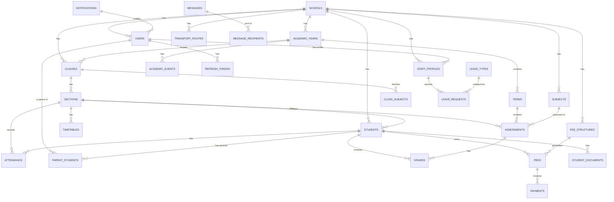

# EduFlow Database Schema
# Complete PostgreSQL Schema Documentation

---

## Document Control

| Field | Details |
|-------|---------|
| **Version** | 1.0 |
| **Created** | December 9, 2024 |
| **Last Updated** | December 9, 2024 |
| **Database** | PostgreSQL 16 |
| **Related Documents** | EduFlow_Technical_Design_Document.md |

---

## Table of Contents

1. [Overview](#overview)
2. [Schema Conventions](#schema-conventions)
3. [Entity Relationship Diagram](#entity-relationship-diagram)
4. [Core Tables](#1-core-tables)
5. [User Management](#2-user-management)
6. [Academic Structure](#3-academic-structure)
7. [Student Management](#4-student-management)
8. [Attendance Module](#5-attendance-module)
9. [Grades & Assessments](#6-grades--assessments)
10. [Fee Management](#7-fee-management)
11. [Staff & HR Management](#8-staff--hr-management)
12. [Transport Management](#9-transport-management)
13. [Timetables & Scheduling](#10-timetables--scheduling)
14. [Messaging & Notifications](#11-messaging--notifications)
15. [Audit & Logging](#12-audit--logging)
16. [Indexes Strategy](#indexes-strategy)
17. [Data Retention Policies](#data-retention-policies)

---

## Overview

EduFlow uses **PostgreSQL 16** as the primary relational database for all transactional data. This document contains the complete schema definition with all tables, relationships, indexes, and constraints.

**Secondary Storage:**
- **MongoDB 7.0**: Chat messages, analytics events, activity feeds
- **Redis 7.2**: Sessions, caching, real-time pub/sub

---

## Schema Conventions

| Convention | Implementation |
|------------|---------------|
| **Primary Keys** | UUID v4 (`gen_random_uuid()`) |
| **Naming** | `snake_case` for tables and columns |
| **Table Names** | Plural (`students`, `classes`) |
| **Foreign Keys** | `{singular_table}_id` (e.g., `school_id`) |
| **Timestamps** | `TIMESTAMP WITH TIME ZONE` |
| **Soft Delete** | `deleted_at` column (null = active) |
| **Multi-tenancy** | `school_id` on all tenant-scoped tables |
| **Enums** | PostgreSQL ENUM types |
| **JSON** | JSONB for flexible structured data |

---

## Entity Relationship Diagram



---

## 1. Core Tables

### schools

Central tenant table for multi-tenancy.

```sql
CREATE TABLE schools (
    id UUID PRIMARY KEY DEFAULT gen_random_uuid(),
    
    -- Basic Info
    name VARCHAR(255) NOT NULL,
    name_urdu VARCHAR(255),
    code VARCHAR(50) UNIQUE NOT NULL,          -- Unique school code (e.g., LHR-001)
    
    -- Contact
    logo_url VARCHAR(500),
    address TEXT,
    city VARCHAR(100),
    district VARCHAR(100),
    province VARCHAR(100),
    postal_code VARCHAR(20),
    phone VARCHAR(20),
    email VARCHAR(255),
    website VARCHAR(255),
    
    -- Branding
    primary_color VARCHAR(7) DEFAULT '#4F46E5',
    secondary_color VARCHAR(7) DEFAULT '#10B981',
    
    -- Subscription & Limits
    subscription_tier VARCHAR(20) DEFAULT 'free',  -- free, basic, professional, enterprise
    subscription_start DATE,
    subscription_end DATE,
    max_students INTEGER DEFAULT 100,
    max_staff INTEGER DEFAULT 20,
    
    -- Settings (flexible JSON)
    settings JSONB DEFAULT '{
        "academic_year_start_month": 4,
        "grading_scale": "default",
        "attendance_time_limit_minutes": 120,
        "late_fee_enabled": true,
        "sms_notifications_enabled": false,
        "currency": "PKR",
        "timezone": "Asia/Karachi"
    }',
    
    -- Status
    is_active BOOLEAN DEFAULT true,
    
    -- Timestamps
    created_at TIMESTAMP WITH TIME ZONE DEFAULT NOW(),
    updated_at TIMESTAMP WITH TIME ZONE DEFAULT NOW(),
    deleted_at TIMESTAMP WITH TIME ZONE          -- Soft delete
);

-- Indexes
CREATE INDEX idx_schools_code ON schools(code);
CREATE INDEX idx_schools_active ON schools(is_active) WHERE deleted_at IS NULL;
CREATE INDEX idx_schools_city ON schools(city);
```

---

## 2. User Management

### users

All system users (admins, teachers, parents, students).

```sql
CREATE TYPE user_role AS ENUM (
    'super_admin',
    'school_admin',
    'principal',
    'vice_principal',
    'teacher',
    'accountant',
    'hr',
    'librarian',
    'receptionist',
    'parent',
    'student'
);

CREATE TYPE user_status AS ENUM ('active', 'inactive', 'pending', 'suspended');

CREATE TABLE users (
    id UUID PRIMARY KEY DEFAULT gen_random_uuid(),
    school_id UUID REFERENCES schools(id) ON DELETE CASCADE,
    
    -- Authentication
    email VARCHAR(255) NOT NULL,
    password_hash VARCHAR(255) NOT NULL,
    phone VARCHAR(20),
    
    -- Profile
    first_name VARCHAR(100) NOT NULL,
    last_name VARCHAR(100) NOT NULL,
    first_name_urdu VARCHAR(100),
    last_name_urdu VARCHAR(100),
    avatar_url VARCHAR(500),
    
    -- Role & Status
    role user_role NOT NULL,
    status user_status DEFAULT 'pending',
    
    -- Security
    email_verified BOOLEAN DEFAULT false,
    email_verified_at TIMESTAMP WITH TIME ZONE,
    phone_verified BOOLEAN DEFAULT false,
    two_factor_enabled BOOLEAN DEFAULT false,
    two_factor_secret VARCHAR(255),
    failed_login_attempts INTEGER DEFAULT 0,
    locked_until TIMESTAMP WITH TIME ZONE,
    
    -- Preferences
    notification_preferences JSONB DEFAULT '{
        "attendance": true,
        "grades": true,
        "fees": true,
        "messages": true,
        "announcements": true,
        "email_enabled": true,
        "sms_enabled": false,
        "push_enabled": true,
        "quiet_hours_start": null,
        "quiet_hours_end": null
    }',
    
    -- Session tracking
    last_login_at TIMESTAMP WITH TIME ZONE,
    last_login_ip INET,
    password_changed_at TIMESTAMP WITH TIME ZONE,
    
    -- Timestamps
    created_at TIMESTAMP WITH TIME ZONE DEFAULT NOW(),
    updated_at TIMESTAMP WITH TIME ZONE DEFAULT NOW(),
    deleted_at TIMESTAMP WITH TIME ZONE,
    
    -- Constraints
    CONSTRAINT unique_email_per_school UNIQUE (school_id, email)
);

-- Indexes
CREATE INDEX idx_users_school ON users(school_id) WHERE deleted_at IS NULL;
CREATE INDEX idx_users_email ON users(email);
CREATE INDEX idx_users_role ON users(role);
CREATE INDEX idx_users_status ON users(status);
CREATE INDEX idx_users_phone ON users(phone);
```

### refresh_tokens

JWT refresh token storage for session management.

```sql
CREATE TABLE refresh_tokens (
    id UUID PRIMARY KEY DEFAULT gen_random_uuid(),
    user_id UUID NOT NULL REFERENCES users(id) ON DELETE CASCADE,
    
    token_hash VARCHAR(255) NOT NULL,           -- SHA-256 hash of token
    device_info VARCHAR(255),                   -- Browser/device identifier
    ip_address INET,
    user_agent TEXT,
    
    expires_at TIMESTAMP WITH TIME ZONE NOT NULL,
    revoked_at TIMESTAMP WITH TIME ZONE,
    revoked_reason VARCHAR(100),
    
    created_at TIMESTAMP WITH TIME ZONE DEFAULT NOW()
);

-- Indexes
CREATE INDEX idx_refresh_tokens_user ON refresh_tokens(user_id);
CREATE INDEX idx_refresh_tokens_expires ON refresh_tokens(expires_at);
CREATE INDEX idx_refresh_tokens_hash ON refresh_tokens(token_hash);
```

### password_history

For password reuse prevention.

```sql
CREATE TABLE password_history (
    id UUID PRIMARY KEY DEFAULT gen_random_uuid(),
    user_id UUID NOT NULL REFERENCES users(id) ON DELETE CASCADE,
    password_hash VARCHAR(255) NOT NULL,
    created_at TIMESTAMP WITH TIME ZONE DEFAULT NOW()
);

CREATE INDEX idx_password_history_user ON password_history(user_id);
```

---

## 3. Academic Structure

### academic_years

School academic sessions.

```sql
CREATE TABLE academic_years (
    id UUID PRIMARY KEY DEFAULT gen_random_uuid(),
    school_id UUID NOT NULL REFERENCES schools(id) ON DELETE CASCADE,
    
    name VARCHAR(50) NOT NULL,                  -- "2024-2025"
    start_date DATE NOT NULL,
    end_date DATE NOT NULL,
    is_current BOOLEAN DEFAULT false,
    
    created_at TIMESTAMP WITH TIME ZONE DEFAULT NOW(),
    updated_at TIMESTAMP WITH TIME ZONE DEFAULT NOW(),
    
    CONSTRAINT unique_year_per_school UNIQUE (school_id, name),
    CONSTRAINT valid_date_range CHECK (end_date > start_date)
);

CREATE INDEX idx_academic_years_school ON academic_years(school_id);
CREATE INDEX idx_academic_years_current ON academic_years(school_id, is_current) WHERE is_current = true;
```

### terms

Academic terms within a year (for term-wise grading).

```sql
CREATE TABLE terms (
    id UUID PRIMARY KEY DEFAULT gen_random_uuid(),
    academic_year_id UUID NOT NULL REFERENCES academic_years(id) ON DELETE CASCADE,
    school_id UUID NOT NULL REFERENCES schools(id) ON DELETE CASCADE,
    
    name VARCHAR(100) NOT NULL,                 -- "First Term", "Mid-Year", "Final"
    term_number INTEGER NOT NULL,               -- 1, 2, 3
    start_date DATE NOT NULL,
    end_date DATE NOT NULL,
    
    -- Report card configuration
    result_publish_date DATE,
    is_published BOOLEAN DEFAULT false,
    
    is_current BOOLEAN DEFAULT false,
    
    created_at TIMESTAMP WITH TIME ZONE DEFAULT NOW(),
    updated_at TIMESTAMP WITH TIME ZONE DEFAULT NOW(),
    
    CONSTRAINT unique_term_per_year UNIQUE (academic_year_id, term_number),
    CONSTRAINT valid_term_dates CHECK (end_date > start_date)
);

CREATE INDEX idx_terms_year ON terms(academic_year_id);
CREATE INDEX idx_terms_school ON terms(school_id);
CREATE INDEX idx_terms_current ON terms(school_id, is_current) WHERE is_current = true;
```

### classes

Grade levels (Class 1-10, etc.).

```sql
CREATE TABLE classes (
    id UUID PRIMARY KEY DEFAULT gen_random_uuid(),
    school_id UUID NOT NULL REFERENCES schools(id) ON DELETE CASCADE,
    academic_year_id UUID NOT NULL REFERENCES academic_years(id) ON DELETE CASCADE,
    
    name VARCHAR(50) NOT NULL,                  -- "Class 5", "Grade 10", "Nursery"
    grade_level INTEGER,                        -- Numeric level for sorting (1-12)
    display_order INTEGER DEFAULT 0,
    
    created_at TIMESTAMP WITH TIME ZONE DEFAULT NOW(),
    
    CONSTRAINT unique_class_per_year UNIQUE (school_id, academic_year_id, name)
);

CREATE INDEX idx_classes_school ON classes(school_id);
CREATE INDEX idx_classes_year ON classes(academic_year_id);
CREATE INDEX idx_classes_order ON classes(school_id, display_order);
```

### sections

Class sections (A, B, Blue, etc.).

```sql
CREATE TABLE sections (
    id UUID PRIMARY KEY DEFAULT gen_random_uuid(),
    class_id UUID NOT NULL REFERENCES classes(id) ON DELETE CASCADE,
    
    name VARCHAR(10) NOT NULL,                  -- "A", "B", "Blue"
    room_number VARCHAR(20),
    capacity INTEGER DEFAULT 40,
    
    class_teacher_id UUID REFERENCES users(id) ON DELETE SET NULL,
    
    created_at TIMESTAMP WITH TIME ZONE DEFAULT NOW(),
    updated_at TIMESTAMP WITH TIME ZONE DEFAULT NOW(),
    
    CONSTRAINT unique_section_per_class UNIQUE (class_id, name)
);

CREATE INDEX idx_sections_class ON sections(class_id);
CREATE INDEX idx_sections_teacher ON sections(class_teacher_id);
```

### subjects

School subjects.

```sql
CREATE TABLE subjects (
    id UUID PRIMARY KEY DEFAULT gen_random_uuid(),
    school_id UUID NOT NULL REFERENCES schools(id) ON DELETE CASCADE,
    
    name VARCHAR(100) NOT NULL,                 -- "Mathematics"
    name_urdu VARCHAR(100),                     -- "ریاضی"
    code VARCHAR(20),                           -- "MATH"
    description TEXT,
    
    is_mandatory BOOLEAN DEFAULT true,
    is_active BOOLEAN DEFAULT true,
    
    created_at TIMESTAMP WITH TIME ZONE DEFAULT NOW(),
    updated_at TIMESTAMP WITH TIME ZONE DEFAULT NOW()
);

CREATE INDEX idx_subjects_school ON subjects(school_id);
CREATE INDEX idx_subjects_code ON subjects(school_id, code);
```

### class_subjects

Subject-class-teacher mapping.

```sql
CREATE TABLE class_subjects (
    id UUID PRIMARY KEY DEFAULT gen_random_uuid(),
    class_id UUID NOT NULL REFERENCES classes(id) ON DELETE CASCADE,
    subject_id UUID NOT NULL REFERENCES subjects(id) ON DELETE CASCADE,
    
    teacher_id UUID REFERENCES users(id) ON DELETE SET NULL,
    periods_per_week INTEGER DEFAULT 4,
    
    created_at TIMESTAMP WITH TIME ZONE DEFAULT NOW(),
    
    CONSTRAINT unique_class_subject UNIQUE (class_id, subject_id)
);

CREATE INDEX idx_class_subjects_class ON class_subjects(class_id);
CREATE INDEX idx_class_subjects_teacher ON class_subjects(teacher_id);
```

### academic_events

School calendar events and holidays.

```sql
CREATE TYPE event_type AS ENUM (
    'holiday',
    'exam_schedule',
    'pta_meeting',
    'sports_day',
    'cultural_event',
    'workshop',
    'field_trip',
    'other'
);

CREATE TABLE academic_events (
    id UUID PRIMARY KEY DEFAULT gen_random_uuid(),
    school_id UUID NOT NULL REFERENCES schools(id) ON DELETE CASCADE,
    academic_year_id UUID REFERENCES academic_years(id) ON DELETE SET NULL,
    
    title VARCHAR(255) NOT NULL,
    description TEXT,
    event_type event_type NOT NULL,
    
    start_date DATE NOT NULL,
    end_date DATE,                              -- NULL for single-day events
    start_time TIME,
    end_time TIME,
    
    is_holiday BOOLEAN DEFAULT false,           -- Marks attendance as holiday
    is_all_day BOOLEAN DEFAULT true,
    
    -- Target audience (NULL = all)
    target_classes UUID[],                      -- Specific classes
    target_sections UUID[],                     -- Specific sections
    
    location VARCHAR(255),
    
    created_by UUID REFERENCES users(id),
    created_at TIMESTAMP WITH TIME ZONE DEFAULT NOW(),
    updated_at TIMESTAMP WITH TIME ZONE DEFAULT NOW()
);

CREATE INDEX idx_events_school ON academic_events(school_id);
CREATE INDEX idx_events_date ON academic_events(start_date);
CREATE INDEX idx_events_type ON academic_events(event_type);
CREATE INDEX idx_events_holiday ON academic_events(school_id, is_holiday) WHERE is_holiday = true;
```

---

## 4. Student Management

### students

Student records.

```sql
CREATE TYPE student_status AS ENUM (
    'active',
    'graduated',
    'transferred',
    'withdrawn',
    'suspended',
    'alumni'
);

CREATE TABLE students (
    id UUID PRIMARY KEY DEFAULT gen_random_uuid(),
    school_id UUID NOT NULL REFERENCES schools(id) ON DELETE CASCADE,
    section_id UUID REFERENCES sections(id) ON DELETE SET NULL,
    
    -- Registration
    registration_no VARCHAR(50),                -- School's internal number
    roll_number VARCHAR(20),                    -- Class roll number
    admission_date DATE NOT NULL,
    
    -- Personal Info
    first_name VARCHAR(100) NOT NULL,
    last_name VARCHAR(100) NOT NULL,
    first_name_urdu VARCHAR(100),
    last_name_urdu VARCHAR(100),
    
    date_of_birth DATE NOT NULL,
    gender VARCHAR(10),                         -- male, female, other
    blood_group VARCHAR(5),
    religion VARCHAR(50),
    nationality VARCHAR(50) DEFAULT 'Pakistani',
    
    -- Identity Documents
    cnic_bform VARCHAR(15),                     -- B-Form for minors
    
    -- Family Info
    father_name VARCHAR(200),
    father_name_urdu VARCHAR(200),
    father_cnic VARCHAR(15),
    father_phone VARCHAR(20),
    father_occupation VARCHAR(100),
    father_email VARCHAR(255),
    
    mother_name VARCHAR(200),
    mother_phone VARCHAR(20),
    mother_occupation VARCHAR(100),
    
    guardian_name VARCHAR(200),
    guardian_phone VARCHAR(20),
    guardian_relation VARCHAR(50),
    
    -- Contact
    address TEXT,
    city VARCHAR(100),
    postal_code VARCHAR(20),
    
    -- Emergency Contact
    emergency_contact_name VARCHAR(200),
    emergency_contact_phone VARCHAR(20),
    emergency_contact_relation VARCHAR(50),
    
    -- Medical
    medical_conditions TEXT,
    allergies TEXT,
    special_needs TEXT,
    
    -- Photo
    photo_url VARCHAR(500),
    
    -- Previous Education
    previous_school VARCHAR(255),
    previous_class VARCHAR(50),
    transfer_certificate_no VARCHAR(100),
    
    -- Transport
    uses_transport BOOLEAN DEFAULT false,
    transport_route_id UUID,                    -- References transport_routes
    
    -- Sibling Tracking (for discounts)
    sibling_group_id UUID,                      -- Same UUID for siblings
    
    -- Promotion Tracking
    previous_section_id UUID REFERENCES sections(id),
    
    -- Status
    status student_status DEFAULT 'active',
    
    -- Timestamps
    created_at TIMESTAMP WITH TIME ZONE DEFAULT NOW(),
    updated_at TIMESTAMP WITH TIME ZONE DEFAULT NOW(),
    deleted_at TIMESTAMP WITH TIME ZONE,
    
    CONSTRAINT unique_reg_per_school UNIQUE (school_id, registration_no)
);

-- Indexes
CREATE INDEX idx_students_school ON students(school_id) WHERE deleted_at IS NULL;
CREATE INDEX idx_students_section ON students(section_id);
CREATE INDEX idx_students_status ON students(status);
CREATE INDEX idx_students_name ON students(first_name, last_name);
CREATE INDEX idx_students_reg ON students(school_id, registration_no);
CREATE INDEX idx_students_sibling ON students(sibling_group_id) WHERE sibling_group_id IS NOT NULL;
CREATE INDEX idx_students_father_phone ON students(father_phone);
```

### parent_students

Parent-student relationship (many-to-many).

```sql
CREATE TABLE parent_students (
    id UUID PRIMARY KEY DEFAULT gen_random_uuid(),
    parent_id UUID NOT NULL REFERENCES users(id) ON DELETE CASCADE,
    student_id UUID NOT NULL REFERENCES students(id) ON DELETE CASCADE,
    
    relationship VARCHAR(50) DEFAULT 'parent',  -- parent, mother, father, guardian
    is_primary BOOLEAN DEFAULT false,           -- Primary contact for notifications
    can_pickup BOOLEAN DEFAULT true,
    can_pay_fees BOOLEAN DEFAULT true,
    
    created_at TIMESTAMP WITH TIME ZONE DEFAULT NOW(),
    
    CONSTRAINT unique_parent_student UNIQUE (parent_id, student_id)
);

CREATE INDEX idx_parent_students_parent ON parent_students(parent_id);
CREATE INDEX idx_parent_students_student ON parent_students(student_id);
CREATE INDEX idx_parent_students_primary ON parent_students(student_id, is_primary) WHERE is_primary = true;
```

### student_documents

Document attachments for students.

```sql
CREATE TYPE document_type AS ENUM (
    'birth_certificate',
    'bform',
    'cnic_copy',
    'photo',
    'previous_report_card',
    'transfer_certificate',
    'medical_certificate',
    'other'
);

CREATE TABLE student_documents (
    id UUID PRIMARY KEY DEFAULT gen_random_uuid(),
    student_id UUID NOT NULL REFERENCES students(id) ON DELETE CASCADE,
    
    document_type document_type NOT NULL,
    document_name VARCHAR(255) NOT NULL,
    file_url VARCHAR(500) NOT NULL,
    file_size INTEGER,                          -- In bytes
    mime_type VARCHAR(100),
    
    uploaded_by UUID REFERENCES users(id),
    verified BOOLEAN DEFAULT false,
    verified_by UUID REFERENCES users(id),
    verified_at TIMESTAMP WITH TIME ZONE,
    
    created_at TIMESTAMP WITH TIME ZONE DEFAULT NOW()
);

CREATE INDEX idx_student_docs ON student_documents(student_id);
CREATE INDEX idx_student_docs_type ON student_documents(student_id, document_type);
```

---

## 5. Attendance Module

### attendance

Daily attendance records.

```sql
CREATE TYPE attendance_status AS ENUM (
    'present',
    'absent',
    'late',
    'early_dismissal',
    'half_day',
    'sick_leave',
    'approved_leave',
    'holiday'
);

CREATE TABLE attendance (
    id UUID PRIMARY KEY DEFAULT gen_random_uuid(),
    student_id UUID NOT NULL REFERENCES students(id) ON DELETE CASCADE,
    section_id UUID NOT NULL REFERENCES sections(id) ON DELETE CASCADE,
    
    date DATE NOT NULL,
    status attendance_status NOT NULL DEFAULT 'present',
    
    -- Timing details
    check_in_time TIME,
    check_out_time TIME,
    late_minutes INTEGER DEFAULT 0,
    
    notes TEXT,
    
    -- Metadata
    marked_by UUID NOT NULL REFERENCES users(id),
    marked_at TIMESTAMP WITH TIME ZONE DEFAULT NOW(),
    
    -- Corrections
    is_corrected BOOLEAN DEFAULT false,
    corrected_by UUID REFERENCES users(id),
    corrected_at TIMESTAMP WITH TIME ZONE,
    correction_reason TEXT,
    original_status attendance_status,
    
    -- Offline sync support
    client_id VARCHAR(100),                     -- For offline conflict resolution
    synced_at TIMESTAMP WITH TIME ZONE,
    
    -- Timestamps
    created_at TIMESTAMP WITH TIME ZONE DEFAULT NOW(),
    updated_at TIMESTAMP WITH TIME ZONE DEFAULT NOW(),
    
    CONSTRAINT unique_attendance_per_day UNIQUE (student_id, date)
);

-- Indexes
CREATE INDEX idx_attendance_student ON attendance(student_id);
CREATE INDEX idx_attendance_section ON attendance(section_id);
CREATE INDEX idx_attendance_date ON attendance(date);
CREATE INDEX idx_attendance_section_date ON attendance(section_id, date);
CREATE INDEX idx_attendance_status ON attendance(status);
CREATE INDEX idx_attendance_marked_by ON attendance(marked_by);

-- Partition by month for performance (optional for large schools)
-- CREATE TABLE attendance_2024_12 PARTITION OF attendance FOR VALUES FROM ('2024-12-01') TO ('2025-01-01');
```

---

## 6. Grades & Assessments

### grading_scales

School-specific grading scales.

```sql
CREATE TABLE grading_scales (
    id UUID PRIMARY KEY DEFAULT gen_random_uuid(),
    school_id UUID NOT NULL REFERENCES schools(id) ON DELETE CASCADE,
    
    name VARCHAR(100) NOT NULL,
    is_default BOOLEAN DEFAULT false,
    
    -- Scale definition
    scales JSONB NOT NULL DEFAULT '[
        {"letter": "A+", "min": 90, "max": 100, "gpa": 4.0, "remarks": "Outstanding"},
        {"letter": "A", "min": 80, "max": 89, "gpa": 3.7, "remarks": "Excellent"},
        {"letter": "B+", "min": 70, "max": 79, "gpa": 3.3, "remarks": "Very Good"},
        {"letter": "B", "min": 60, "max": 69, "gpa": 3.0, "remarks": "Good"},
        {"letter": "C+", "min": 50, "max": 59, "gpa": 2.5, "remarks": "Satisfactory"},
        {"letter": "C", "min": 40, "max": 49, "gpa": 2.0, "remarks": "Pass"},
        {"letter": "D", "min": 33, "max": 39, "gpa": 1.0, "remarks": "Poor"},
        {"letter": "F", "min": 0, "max": 32, "gpa": 0.0, "remarks": "Fail"}
    ]',
    
    created_at TIMESTAMP WITH TIME ZONE DEFAULT NOW()
);

CREATE INDEX idx_grading_scales_school ON grading_scales(school_id);
CREATE INDEX idx_grading_scales_default ON grading_scales(school_id, is_default) WHERE is_default = true;
```

### assessments

Exams, quizzes, assignments.

```sql
CREATE TYPE assessment_category AS ENUM (
    'quiz',
    'assignment',
    'classwork',
    'homework',
    'project',
    'practical',
    'midterm',
    'final',
    'monthly_test',
    'other'
);

CREATE TABLE assessments (
    id UUID PRIMARY KEY DEFAULT gen_random_uuid(),
    section_id UUID NOT NULL REFERENCES sections(id) ON DELETE CASCADE,
    subject_id UUID NOT NULL REFERENCES subjects(id) ON DELETE CASCADE,
    term_id UUID REFERENCES terms(id) ON DELETE SET NULL,  -- Term linkage
    
    name VARCHAR(200) NOT NULL,                 -- "Quiz 1", "Midterm Exam"
    category assessment_category NOT NULL,
    
    total_marks DECIMAL(5,2) NOT NULL,
    passing_marks DECIMAL(5,2),
    weightage DECIMAL(5,2) DEFAULT 100,         -- Percentage weight in term grade
    
    assessment_date DATE NOT NULL,
    due_date DATE,                              -- For assignments
    
    description TEXT,
    instructions TEXT,
    
    is_published BOOLEAN DEFAULT false,         -- Grades visible to parents/students
    published_at TIMESTAMP WITH TIME ZONE,
    
    created_by UUID NOT NULL REFERENCES users(id),
    
    created_at TIMESTAMP WITH TIME ZONE DEFAULT NOW(),
    updated_at TIMESTAMP WITH TIME ZONE DEFAULT NOW(),
    deleted_at TIMESTAMP WITH TIME ZONE
);

-- Indexes
CREATE INDEX idx_assessments_section ON assessments(section_id) WHERE deleted_at IS NULL;
CREATE INDEX idx_assessments_subject ON assessments(subject_id);
CREATE INDEX idx_assessments_term ON assessments(term_id);
CREATE INDEX idx_assessments_date ON assessments(assessment_date);
CREATE INDEX idx_assessments_category ON assessments(category);
```

### grades

Individual student grades.

```sql
CREATE TABLE grades (
    id UUID PRIMARY KEY DEFAULT gen_random_uuid(),
    student_id UUID NOT NULL REFERENCES students(id) ON DELETE CASCADE,
    assessment_id UUID NOT NULL REFERENCES assessments(id) ON DELETE CASCADE,
    
    marks_obtained DECIMAL(5,2),
    percentage DECIMAL(5,2),                    -- Calculated field
    letter_grade VARCHAR(5),                    -- A+, A, B+, etc. (from grading_scales)
    gpa DECIMAL(3,2),
    
    remarks TEXT,
    
    is_absent BOOLEAN DEFAULT false,            -- If student was absent
    is_exempted BOOLEAN DEFAULT false,          -- Medical/other exemption
    exemption_reason TEXT,
    
    -- Data entry tracking
    entered_by UUID NOT NULL REFERENCES users(id),
    entered_at TIMESTAMP WITH TIME ZONE DEFAULT NOW(),
    
    -- Auto-save support
    is_draft BOOLEAN DEFAULT false,
    last_auto_saved TIMESTAMP WITH TIME ZONE,
    
    updated_at TIMESTAMP WITH TIME ZONE DEFAULT NOW(),
    
    CONSTRAINT unique_grade_per_assessment UNIQUE (student_id, assessment_id)
);

-- Indexes
CREATE INDEX idx_grades_student ON grades(student_id);
CREATE INDEX idx_grades_assessment ON grades(assessment_id);
CREATE INDEX idx_grades_entered_by ON grades(entered_by);
```

---

## 7. Fee Management

### fee_structures

Fee templates.

```sql
CREATE TYPE fee_type AS ENUM (
    'tuition',
    'admission',
    'registration',
    'examination',
    'transport',
    'books',
    'uniform',
    'activities',
    'sports',
    'lab',
    'computer',
    'library',
    'security',
    'development',
    'other'
);

CREATE TYPE fee_frequency AS ENUM (
    'one_time',
    'monthly',
    'quarterly',
    'biannual',
    'annual'
);

CREATE TABLE fee_structures (
    id UUID PRIMARY KEY DEFAULT gen_random_uuid(),
    school_id UUID NOT NULL REFERENCES schools(id) ON DELETE CASCADE,
    academic_year_id UUID NOT NULL REFERENCES academic_years(id),
    
    name VARCHAR(200) NOT NULL,
    fee_type fee_type NOT NULL,
    frequency fee_frequency NOT NULL,
    amount DECIMAL(10,2) NOT NULL,
    
    -- Apply to specific classes (NULL = all)
    applicable_classes UUID[],
    
    -- Late fee configuration
    late_fee_type VARCHAR(20) DEFAULT 'fixed',  -- 'fixed' or 'percentage'
    late_fee_amount DECIMAL(10,2) DEFAULT 0,
    late_fee_percentage DECIMAL(5,2) DEFAULT 0,
    grace_period_days INTEGER DEFAULT 10,
    
    due_day_of_month INTEGER DEFAULT 10,        -- For monthly fees
    
    is_active BOOLEAN DEFAULT true,
    
    created_at TIMESTAMP WITH TIME ZONE DEFAULT NOW(),
    updated_at TIMESTAMP WITH TIME ZONE DEFAULT NOW()
);

CREATE INDEX idx_fee_structures_school ON fee_structures(school_id);
CREATE INDEX idx_fee_structures_year ON fee_structures(academic_year_id);
CREATE INDEX idx_fee_structures_type ON fee_structures(fee_type);
```

### fees

Assigned fees to students.

```sql
CREATE TYPE payment_status AS ENUM (
    'pending',
    'partial',
    'paid',
    'overdue',
    'waived',
    'refunded',
    'cancelled'
);

CREATE TABLE fees (
    id UUID PRIMARY KEY DEFAULT gen_random_uuid(),
    student_id UUID NOT NULL REFERENCES students(id) ON DELETE CASCADE,
    fee_structure_id UUID REFERENCES fee_structures(id),
    
    fee_type fee_type NOT NULL,
    description VARCHAR(255),
    
    -- Amounts
    amount DECIMAL(10,2) NOT NULL,
    discount_amount DECIMAL(10,2) DEFAULT 0,
    discount_reason VARCHAR(255),               -- sibling, merit, staff_child
    late_fee DECIMAL(10,2) DEFAULT 0,
    late_fee_applied_at TIMESTAMP WITH TIME ZONE,
    
    -- Calculated totals
    total_amount DECIMAL(10,2) NOT NULL,        -- amount - discount + late_fee
    paid_amount DECIMAL(10,2) DEFAULT 0,
    balance DECIMAL(10,2) NOT NULL,
    
    due_date DATE NOT NULL,
    
    status payment_status DEFAULT 'pending',
    
    -- For month-specific fees
    fee_month DATE,                             -- Which month this fee is for
    
    created_at TIMESTAMP WITH TIME ZONE DEFAULT NOW(),
    updated_at TIMESTAMP WITH TIME ZONE DEFAULT NOW(),
    deleted_at TIMESTAMP WITH TIME ZONE
);

-- Indexes
CREATE INDEX idx_fees_student ON fees(student_id) WHERE deleted_at IS NULL;
CREATE INDEX idx_fees_status ON fees(status);
CREATE INDEX idx_fees_due_date ON fees(due_date);
CREATE INDEX idx_fees_overdue ON fees(status, due_date) WHERE status = 'pending';
```

### payments

Payment transactions.

```sql
CREATE TYPE payment_method AS ENUM (
    'cash',
    'bank_transfer',
    'jazzcash',
    'easypaisa',
    'stripe',
    'cheque',
    'online_banking',
    'other'
);

CREATE TABLE payments (
    id UUID PRIMARY KEY DEFAULT gen_random_uuid(),
    fee_id UUID NOT NULL REFERENCES fees(id) ON DELETE CASCADE,
    student_id UUID NOT NULL REFERENCES students(id),
    
    amount DECIMAL(10,2) NOT NULL,
    payment_method payment_method NOT NULL,
    
    -- Transaction details
    transaction_id VARCHAR(100),                -- External gateway ID
    gateway_response JSONB,
    
    -- Receipt
    receipt_number VARCHAR(50),
    receipt_url VARCHAR(500),
    
    -- For manual payments
    received_by UUID REFERENCES users(id),
    
    payment_date DATE NOT NULL DEFAULT CURRENT_DATE,
    notes TEXT,
    
    -- Refund tracking
    is_refunded BOOLEAN DEFAULT false,
    refunded_at TIMESTAMP WITH TIME ZONE,
    refund_amount DECIMAL(10,2),
    refund_reason TEXT,
    
    created_at TIMESTAMP WITH TIME ZONE DEFAULT NOW(),
    deleted_at TIMESTAMP WITH TIME ZONE
);

-- Indexes
CREATE INDEX idx_payments_fee ON payments(fee_id) WHERE deleted_at IS NULL;
CREATE INDEX idx_payments_student ON payments(student_id);
CREATE INDEX idx_payments_date ON payments(payment_date);
CREATE INDEX idx_payments_method ON payments(payment_method);
CREATE INDEX idx_payments_receipt ON payments(receipt_number);
```

---

## 8. Staff & HR Management

### staff_profiles

Extended employee information.

```sql
CREATE TYPE contract_type AS ENUM (
    'permanent',
    'contract',
    'probation',
    'visiting',
    'intern'
);

CREATE TABLE staff_profiles (
    id UUID PRIMARY KEY DEFAULT gen_random_uuid(),
    user_id UUID NOT NULL REFERENCES users(id) ON DELETE CASCADE,
    school_id UUID NOT NULL REFERENCES schools(id) ON DELETE CASCADE,
    
    -- Employment details
    employee_code VARCHAR(50),
    designation VARCHAR(100),
    department VARCHAR(100),
    date_of_joining DATE,
    contract_type contract_type DEFAULT 'permanent',
    contract_end_date DATE,
    reporting_to UUID REFERENCES users(id),
    
    -- Compensation
    salary DECIMAL(12,2),
    salary_type VARCHAR(20) DEFAULT 'monthly',  -- monthly, hourly
    bank_name VARCHAR(100),
    bank_account_number VARCHAR(50),
    bank_branch VARCHAR(100),
    
    -- Personal
    cnic VARCHAR(15),
    date_of_birth DATE,
    gender VARCHAR(10),
    marital_status VARCHAR(20),
    blood_group VARCHAR(5),
    emergency_contact_name VARCHAR(200),
    emergency_contact_phone VARCHAR(20),
    address TEXT,
    
    -- Professional
    qualifications JSONB DEFAULT '[]',          -- [{degree, institution, year, grade}]
    experience_years INTEGER,
    specializations TEXT[],
    certifications JSONB DEFAULT '[]',
    
    -- Documents
    documents JSONB DEFAULT '[]',               -- [{type, url, verified}]
    
    -- Status
    is_active BOOLEAN DEFAULT true,
    termination_date DATE,
    termination_reason TEXT,
    
    created_at TIMESTAMP WITH TIME ZONE DEFAULT NOW(),
    updated_at TIMESTAMP WITH TIME ZONE DEFAULT NOW(),
    deleted_at TIMESTAMP WITH TIME ZONE,
    
    CONSTRAINT unique_employee_code UNIQUE (school_id, employee_code)
);

-- Indexes
CREATE INDEX idx_staff_profiles_user ON staff_profiles(user_id) WHERE deleted_at IS NULL;
CREATE INDEX idx_staff_profiles_school ON staff_profiles(school_id);
CREATE INDEX idx_staff_profiles_department ON staff_profiles(department);
CREATE INDEX idx_staff_profiles_active ON staff_profiles(school_id, is_active) WHERE is_active = true;
```

### leave_types

Leave categories defined by school.

```sql
CREATE TABLE leave_types (
    id UUID PRIMARY KEY DEFAULT gen_random_uuid(),
    school_id UUID NOT NULL REFERENCES schools(id) ON DELETE CASCADE,
    
    name VARCHAR(100) NOT NULL,                 -- "Casual Leave", "Sick Leave"
    code VARCHAR(20),                           -- "CL", "SL"
    max_days_per_year INTEGER,
    
    is_paid BOOLEAN DEFAULT true,
    requires_approval BOOLEAN DEFAULT true,
    requires_document BOOLEAN DEFAULT false,    -- Medical certificate required
    
    carry_forward BOOLEAN DEFAULT false,
    max_carry_forward_days INTEGER DEFAULT 0,
    
    is_active BOOLEAN DEFAULT true,
    
    created_at TIMESTAMP WITH TIME ZONE DEFAULT NOW()
);

CREATE INDEX idx_leave_types_school ON leave_types(school_id);
```

### leave_requests

Staff leave applications.

```sql
CREATE TYPE leave_status AS ENUM (
    'pending',
    'approved',
    'rejected',
    'cancelled',
    'withdrawn'
);

CREATE TABLE leave_requests (
    id UUID PRIMARY KEY DEFAULT gen_random_uuid(),
    staff_id UUID NOT NULL REFERENCES staff_profiles(id) ON DELETE CASCADE,
    leave_type_id UUID NOT NULL REFERENCES leave_types(id),
    
    start_date DATE NOT NULL,
    end_date DATE NOT NULL,
    total_days DECIMAL(4,1) NOT NULL,           -- Supports half-days
    is_half_day BOOLEAN DEFAULT false,
    half_day_type VARCHAR(20),                  -- 'first_half', 'second_half'
    
    reason TEXT NOT NULL,
    
    -- Approval workflow
    status leave_status DEFAULT 'pending',
    reviewed_by UUID REFERENCES users(id),
    reviewed_at TIMESTAMP WITH TIME ZONE,
    reviewer_comment TEXT,
    
    -- Supporting documents
    document_urls TEXT[],
    
    created_at TIMESTAMP WITH TIME ZONE DEFAULT NOW(),
    updated_at TIMESTAMP WITH TIME ZONE DEFAULT NOW(),
    
    CONSTRAINT valid_leave_dates CHECK (end_date >= start_date)
);

-- Indexes
CREATE INDEX idx_leave_requests_staff ON leave_requests(staff_id);
CREATE INDEX idx_leave_requests_status ON leave_requests(status);
CREATE INDEX idx_leave_requests_dates ON leave_requests(start_date, end_date);
```

---

## 9. Transport Management

### transport_routes

School bus/van routes.

```sql
CREATE TABLE transport_routes (
    id UUID PRIMARY KEY DEFAULT gen_random_uuid(),
    school_id UUID NOT NULL REFERENCES schools(id) ON DELETE CASCADE,
    
    route_name VARCHAR(100) NOT NULL,
    route_number VARCHAR(20),
    
    -- Vehicle details
    vehicle_number VARCHAR(50),
    vehicle_type VARCHAR(50),                   -- bus, van, coaster
    vehicle_capacity INTEGER,
    
    -- Driver details
    driver_name VARCHAR(100),
    driver_phone VARCHAR(20),
    driver_cnic VARCHAR(15),
    driver_license_no VARCHAR(50),
    
    -- Conductor/Helper
    conductor_name VARCHAR(100),
    conductor_phone VARCHAR(20),
    
    -- Fee
    monthly_fee DECIMAL(10,2),
    
    -- Route stops (JSON array with order)
    stops JSONB DEFAULT '[]',                   -- [{order, name, address, pickup_time, lat, lng}]
    
    -- Timing
    departure_time TIME,
    arrival_time TIME,
    
    is_active BOOLEAN DEFAULT true,
    
    created_at TIMESTAMP WITH TIME ZONE DEFAULT NOW(),
    updated_at TIMESTAMP WITH TIME ZONE DEFAULT NOW()
);

-- Indexes
CREATE INDEX idx_transport_routes_school ON transport_routes(school_id);
CREATE INDEX idx_transport_routes_active ON transport_routes(school_id, is_active) WHERE is_active = true;

-- Update students table to reference transport_routes
ALTER TABLE students 
ADD CONSTRAINT fk_students_transport_route 
FOREIGN KEY (transport_route_id) REFERENCES transport_routes(id) ON DELETE SET NULL;
```

---

## 10. Timetables & Scheduling

### timetable_slots

Period definitions for the school day.

```sql
CREATE TABLE timetable_slots (
    id UUID PRIMARY KEY DEFAULT gen_random_uuid(),
    school_id UUID NOT NULL REFERENCES schools(id) ON DELETE CASCADE,
    
    name VARCHAR(50) NOT NULL,                  -- "Period 1", "Lunch Break"
    start_time TIME NOT NULL,
    end_time TIME NOT NULL,
    slot_order INTEGER NOT NULL,
    
    is_break BOOLEAN DEFAULT false,
    break_type VARCHAR(50),                     -- lunch, short_break, prayer
    
    created_at TIMESTAMP WITH TIME ZONE DEFAULT NOW(),
    
    CONSTRAINT unique_slot_per_school UNIQUE (school_id, slot_order),
    CONSTRAINT valid_slot_time CHECK (end_time > start_time)
);

CREATE INDEX idx_timetable_slots_school ON timetable_slots(school_id);
```

### timetables

Class timetable entries.

```sql
CREATE TABLE timetables (
    id UUID PRIMARY KEY DEFAULT gen_random_uuid(),
    section_id UUID NOT NULL REFERENCES sections(id) ON DELETE CASCADE,
    slot_id UUID NOT NULL REFERENCES timetable_slots(id) ON DELETE CASCADE,
    
    day_of_week INTEGER NOT NULL CHECK (day_of_week BETWEEN 1 AND 7), -- 1=Monday, 7=Sunday
    
    subject_id UUID REFERENCES subjects(id) ON DELETE SET NULL,
    teacher_id UUID REFERENCES users(id) ON DELETE SET NULL,
    room_number VARCHAR(20),
    
    created_at TIMESTAMP WITH TIME ZONE DEFAULT NOW(),
    updated_at TIMESTAMP WITH TIME ZONE DEFAULT NOW(),
    
    CONSTRAINT unique_timetable_slot UNIQUE (section_id, slot_id, day_of_week)
);

-- Indexes
CREATE INDEX idx_timetable_section ON timetables(section_id);
CREATE INDEX idx_timetable_teacher ON timetables(teacher_id);
CREATE INDEX idx_timetable_day ON timetables(day_of_week);
CREATE INDEX idx_timetable_subject ON timetables(subject_id);
```

---

## 11. Messaging & Notifications

### messages

Internal messaging and announcements.

```sql
CREATE TYPE message_type AS ENUM (
    'direct',
    'group',
    'broadcast',
    'announcement'
);

CREATE TABLE messages (
    id UUID PRIMARY KEY DEFAULT gen_random_uuid(),
    school_id UUID NOT NULL REFERENCES schools(id) ON DELETE CASCADE,
    
    sender_id UUID NOT NULL REFERENCES users(id),
    message_type message_type NOT NULL,
    
    subject VARCHAR(255),
    body TEXT NOT NULL,
    
    -- For announcements/broadcasts: target audience
    target_roles user_role[],
    target_classes UUID[],
    target_sections UUID[],
    
    is_urgent BOOLEAN DEFAULT false,
    is_pinned BOOLEAN DEFAULT false,
    
    -- Attachments
    attachments JSONB DEFAULT '[]',             -- [{name, url, type, size}]
    
    -- Scheduling
    scheduled_at TIMESTAMP WITH TIME ZONE,
    sent_at TIMESTAMP WITH TIME ZONE,
    
    -- For replies
    parent_message_id UUID REFERENCES messages(id),
    
    created_at TIMESTAMP WITH TIME ZONE DEFAULT NOW()
);

-- Indexes
CREATE INDEX idx_messages_school ON messages(school_id);
CREATE INDEX idx_messages_sender ON messages(sender_id);
CREATE INDEX idx_messages_type ON messages(message_type);
CREATE INDEX idx_messages_parent ON messages(parent_message_id);
CREATE INDEX idx_messages_pinned ON messages(school_id, is_pinned) WHERE is_pinned = true;
```

### message_recipients

Message delivery and read status.

```sql
CREATE TABLE message_recipients (
    id UUID PRIMARY KEY DEFAULT gen_random_uuid(),
    message_id UUID NOT NULL REFERENCES messages(id) ON DELETE CASCADE,
    recipient_id UUID NOT NULL REFERENCES users(id) ON DELETE CASCADE,
    
    is_read BOOLEAN DEFAULT false,
    read_at TIMESTAMP WITH TIME ZONE,
    
    is_archived BOOLEAN DEFAULT false,
    archived_at TIMESTAMP WITH TIME ZONE,
    
    is_starred BOOLEAN DEFAULT false,
    
    created_at TIMESTAMP WITH TIME ZONE DEFAULT NOW(),
    
    CONSTRAINT unique_message_recipient UNIQUE (message_id, recipient_id)
);

-- Indexes
CREATE INDEX idx_msg_recipients_user ON message_recipients(recipient_id);
CREATE INDEX idx_msg_recipients_unread ON message_recipients(recipient_id, is_read) WHERE is_read = false;
```

### notifications

System notifications.

```sql
CREATE TYPE notification_type AS ENUM (
    'attendance_absent',
    'attendance_late',
    'grade_posted',
    'assessment_created',
    'fee_due',
    'fee_overdue',
    'fee_received',
    'fee_reminder',
    'message_received',
    'announcement',
    'assignment_due',
    'leave_approved',
    'leave_rejected',
    'event_reminder',
    'system',
    'general'
);

CREATE TABLE notifications (
    id UUID PRIMARY KEY DEFAULT gen_random_uuid(),
    user_id UUID NOT NULL REFERENCES users(id) ON DELETE CASCADE,
    
    type notification_type NOT NULL,
    title VARCHAR(255) NOT NULL,
    body TEXT,
    
    -- Link to related entity
    entity_type VARCHAR(50),                    -- student, attendance, grade, fee, message
    entity_id UUID,
    
    -- Action URL (for click-through)
    action_url VARCHAR(500),
    
    -- Status
    is_read BOOLEAN DEFAULT false,
    read_at TIMESTAMP WITH TIME ZONE,
    
    -- Delivery tracking
    sent_via_email BOOLEAN DEFAULT false,
    sent_via_sms BOOLEAN DEFAULT false,
    sent_via_push BOOLEAN DEFAULT false,
    email_sent_at TIMESTAMP WITH TIME ZONE,
    sms_sent_at TIMESTAMP WITH TIME ZONE,
    push_sent_at TIMESTAMP WITH TIME ZONE,
    
    -- Metadata
    metadata JSONB DEFAULT '{}',
    
    created_at TIMESTAMP WITH TIME ZONE DEFAULT NOW(),
    expires_at TIMESTAMP WITH TIME ZONE          -- Auto-delete after expiry
);

-- Indexes
CREATE INDEX idx_notifications_user ON notifications(user_id);
CREATE INDEX idx_notifications_unread ON notifications(user_id, is_read) WHERE is_read = false;
CREATE INDEX idx_notifications_type ON notifications(type);
CREATE INDEX idx_notifications_created ON notifications(created_at DESC);
CREATE INDEX idx_notifications_expires ON notifications(expires_at) WHERE expires_at IS NOT NULL;
```

---

## 12. Audit & Logging

### audit_logs

Complete audit trail for compliance.

```sql
CREATE TYPE audit_action AS ENUM (
    'create',
    'update',
    'delete',
    'restore',
    'login',
    'logout',
    'login_failed',
    'password_change',
    'password_reset',
    'export',
    'import',
    'bulk_update'
);

CREATE TABLE audit_logs (
    id UUID PRIMARY KEY DEFAULT gen_random_uuid(),
    school_id UUID REFERENCES schools(id),
    user_id UUID REFERENCES users(id),
    
    action audit_action NOT NULL,
    entity_type VARCHAR(50) NOT NULL,           -- user, student, attendance, etc.
    entity_id UUID,
    
    -- Change tracking
    old_values JSONB,
    new_values JSONB,
    changed_fields TEXT[],
    
    -- Request details
    ip_address INET,
    user_agent TEXT,
    request_id VARCHAR(100),                    -- Correlation ID
    
    -- Additional context
    description TEXT,
    metadata JSONB DEFAULT '{}',
    
    created_at TIMESTAMP WITH TIME ZONE DEFAULT NOW()
);

-- Indexes
CREATE INDEX idx_audit_school ON audit_logs(school_id);
CREATE INDEX idx_audit_user ON audit_logs(user_id);
CREATE INDEX idx_audit_entity ON audit_logs(entity_type, entity_id);
CREATE INDEX idx_audit_action ON audit_logs(action);
CREATE INDEX idx_audit_created ON audit_logs(created_at DESC);

-- Partition by month for performance
-- This is recommended for schools with high activity
-- CREATE TABLE audit_logs_2024_12 PARTITION OF audit_logs 
--     FOR VALUES FROM ('2024-12-01') TO ('2025-01-01');
```

---

## Indexes Strategy

### Primary Indexes

| Table | Index | Purpose |
|-------|-------|---------|
| `students` | `(school_id, section_id)` | List students by class |
| `students` | `(school_id, registration_no)` | Lookup by registration |
| `attendance` | `(student_id, date)` | Student attendance lookup |
| `attendance` | `(section_id, date)` | Class attendance view |
| `grades` | `(student_id, assessment_id)` | Student grade lookup |
| `assessments` | `(section_id, term_id)` | Term-wise assessments |
| `fees` | `(student_id, status)` | Outstanding fees |
| `notifications` | `(user_id, is_read, created_at)` | Unread notifications |
| `messages` | `(sender_id, created_at)` | Sent messages |
| `message_recipients` | `(recipient_id, is_read)` | Inbox |

### Composite Indexes for Common Queries

```sql
-- Teacher's class list
CREATE INDEX idx_students_class_active ON students(section_id, status) 
    WHERE status = 'active' AND deleted_at IS NULL;

-- Pending fees report
CREATE INDEX idx_fees_overdue_report ON fees(school_id, status, due_date) 
    WHERE status IN ('pending', 'overdue') AND deleted_at IS NULL;

-- Today's attendance
CREATE INDEX idx_attendance_today ON attendance(section_id, date, status);

-- User login lookup
CREATE INDEX idx_users_login ON users(email, status) 
    WHERE status = 'active' AND deleted_at IS NULL;
```

---

## Data Retention Policies

| Data Type | Retention Period | Strategy |
|-----------|------------------|----------|
| Active Students | Current + 2 years | Archive after graduation |
| Archived Students | 10 years | Required for records |
| Attendance Records | 10 years | Partition by academic year |
| Grade Records | 10 years | Never delete |
| Fee Transactions | 10 years | Financial audit requirement |
| Payments | 10 years | Financial audit requirement |
| Audit Logs | 2 years | Partition by month, auto-archive |
| Notifications | 90 days | TTL-based deletion |
| Messages | 1 year | Archive older messages |
| Session Tokens | 30 days | Auto-cleanup |

### Cleanup Procedures

```sql
-- Delete expired notifications
DELETE FROM notifications 
WHERE expires_at < NOW() - INTERVAL '7 days';

-- Archive old audit logs (move to cold storage)
-- Run monthly
INSERT INTO audit_logs_archive 
SELECT * FROM audit_logs 
WHERE created_at < NOW() - INTERVAL '2 years';

DELETE FROM audit_logs 
WHERE created_at < NOW() - INTERVAL '2 years';

-- Clean expired refresh tokens
DELETE FROM refresh_tokens 
WHERE expires_at < NOW() OR revoked_at IS NOT NULL;
```

---

## NestJS Entity Mapping

For NestJS with TypeORM, each table maps to an entity:

```typescript
// Example: Student Entity
@Entity('students')
export class Student {
  @PrimaryGeneratedColumn('uuid')
  id: string;

  @Column({ name: 'school_id' })
  schoolId: string;

  @ManyToOne(() => School)
  @JoinColumn({ name: 'school_id' })
  school: School;

  @ManyToOne(() => Section, { nullable: true })
  @JoinColumn({ name: 'section_id' })
  section: Section;

  @Column({ name: 'registration_no', nullable: true })
  registrationNo: string;

  @Column({ name: 'first_name' })
  firstName: string;

  @Column({ name: 'last_name' })
  lastName: string;

  // ... more columns

  @Column({ type: 'enum', enum: StudentStatus, default: StudentStatus.ACTIVE })
  status: StudentStatus;

  @CreateDateColumn({ name: 'created_at' })
  createdAt: Date;

  @UpdateDateColumn({ name: 'updated_at' })
  updatedAt: Date;

  @DeleteDateColumn({ name: 'deleted_at' })
  deletedAt: Date;
}
```

---

## Migration Notes

### Initial Setup

```bash
# Generate migration from entities
npm run typeorm migration:generate -- -n InitialSchema

# Run migrations
npm run typeorm migration:run
```

### Seed Data

Essential seed data for new schools:
1. Default grading scale
2. Default leave types
3. Default timetable slots
4. Admin user

---

**Document End**
